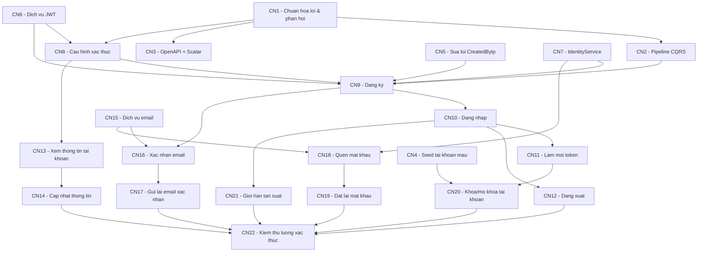

# Roadmap Backend cá nhân — 2312682 Hà Luyến

> **Module:** Tài khoản, Xác thực và Phân quyền (Identity & Profile)
> **Loại tài liệu:** kế hoạch phát triển. Tài liệu này **chưa triển khai code**.
> **Ngày lập:** 23/09/2026
> **Trạng thái code được khảo sát:** nhánh `2312682_LiengHotHaLuyen_Auth_backend` (commit `9d9b799`, đã gồm `develop` mới nhất `40ab20a`).

---

## Mục lục

1. [Thông tin người phụ trách](#1-thông-tin-người-phụ-trách)
2. [Phạm vi công việc](#2-phạm-vi-công-việc)
3. [Tổng quan backend hiện tại](#3-tổng-quan-backend-hiện-tại)
4. [Các module tôi phụ trách](#4-các-module-tôi-phụ-trách)
5. [Chức năng đã hoàn thành](#5-chức-năng-đã-hoàn-thành)
6. [Chức năng đang triển khai](#6-chức-năng-đang-triển-khai)
7. [Chức năng còn thiếu](#7-chức-năng-còn-thiếu)
8. [Dependency giữa các chức năng](#8-dependency-giữa-các-chức-năng)
9. [Roadmap tổng thể](#9-roadmap-tổng-thể)
10. [Quy ước dùng chung cho API Auth](#10-quy-ước-dùng-chung-cho-api-auth)
11. [Chi tiết kế hoạch từng chức năng](#11-chi-tiết-kế-hoạch-từng-chức-năng)
12. [Branch và commit](#12-branch-và-commit)
13. [Thứ tự phát triển](#13-thứ-tự-phát-triển)
14. [Các vấn đề cần lưu ý](#14-các-vấn-đề-cần-lưu-ý)
15. [Chức năng mở rộng](#15-chức-năng-mở-rộng)

---

## 1. Thông tin người phụ trách

| Mục | Nội dung |
|---|---|
| Họ tên | Liêng Hót Ha Luyến (Ha Luyến) |
| MSSV | 2312682 |
| Lớp / Nhóm | CTK47B — Nhóm 11, môn Phát triển Ứng dụng Web Nâng cao |
| Vai trò trong nhóm | Thành viên 1 — Backend module **Tài khoản và xác thực** |
| Branch prefix | `2312682_HaLuyen` |
| Nguồn phân công | `README.md` — mục *Phân công bài tập Lab - Buổi 1/2/3* |

---

## 2. Phạm vi công việc

### 2.1. Căn cứ xác định phạm vi

| Nguồn | Nội dung liên quan |
|---|---|
| `README.md` — Lab 3, cột *Liêng Hót Ha Luyến* | Phân công trực tiếp các việc backend của Buổi 3 (xem 2.2) |
| `docs/requirements/SRS.md` — mục 3.1 (FR-AUTH-001 → 010) | Đặc tả chi tiết các chức năng Auth |
| SRS mục 2.3, 4.2 (NFR-SEC), 6.2, 6.3, 8.1, Phụ lục A/B | Phân quyền 3 tầng, bảo mật JWT/refresh token, kiến trúc, pipeline CQRS, danh sách endpoint, HTTP status, mã lỗi |
| `docs/decisions/RESOLVED-CONFLICTS.md` — C2, C3, D1–D7 | Envelope `{data, meta}` (ngoại lệ `/auth/*`), 400 vs 422, các quyết định Auth, vị trí `ApplicationUser` |
| `docs/architecture/README.md` | Module ownership: *1. Identity & Profile* |

### 2.2. Việc được giao ở Lab 3 (trích README)

- [ ] Tạo Command, Validator, Handler cho **Register, Login, Refresh Token, Logout** và **xác thực Email**.
- [ ] Cài đặt các chức năng quản lý tài khoản còn lại theo SRS, như **Forgot/Reset Password** và **thông tin tài khoản**.
- [ ] Cài đặt **`IdentityService`** để xử lý nghiệp vụ ASP.NET Core Identity.
- [ ] Cài đặt service tạo **JWT Access Token**, quản lý **Refresh Token**; xử lý phân quyền **Author/Admin**.
- [ ] Tạo **Minimal API Endpoint** cho Register, Login, Refresh Token, Logout và các chức năng Account được giao.
- [ ] Cấu hình **Authentication và Authorization** cho các API yêu cầu đăng nhập hoặc Role cụ thể.
- [ ] Kiểm tra luồng **Register → Login → Access Token → Refresh Token → API có phân quyền**.
- [ ] Kiểm tra các trường hợp **sai token, token hết hạn, không đủ quyền, tài khoản không hợp lệ**.

### 2.3. Phần việc chung của cả nhóm mà module Auth phụ thuộc

README Lab 3, mục *Công việc chung*, yêu cầu cả nhóm: cài MediatR/FluentValidation/JWT, thống nhất định dạng Request/Response/lỗi, xử lý lỗi cơ bản (không hợp lệ, không tìm thấy, chưa đăng nhập, không đủ quyền, xung đột). Module Auth **không làm được nếu thiếu các phần này**, nên roadmap đưa chúng vào Phase 1.

> Đây là thành phần dùng chung. Theo `docs/architecture/README.md`, phần dùng chung cần pull request và ít nhất một reviewer ngoài module. Cần báo nhóm trước để không ai làm song song.

### 2.4. Không thuộc phạm vi của tôi

| Nội dung | Người phụ trách (README Lab 3) |
|---|---|
| Category CRUD, Recipe List/Detail, phân trang/lọc/sắp xếp, Full-Text Search | Trần Quốc Quân |
| Create/Update Recipe, Publish/Unpublish/Archive/Unarchive/Delete, ownership, `xmin`/ETag, `RecipeSlugHistory` | Tạ Nhật Nguyên |
| Ingredient, Step, Image, MinIO, upload file | Nguyễn Phú Quý |
| Health check `/health/live`, `/health/ready`, Serilog/OpenTelemetry, Redis, Hangfire | Chưa phân công — việc chung |

Ghi chú: **kiểm tra quyền sở hữu Recipe** (Resource-Based Authorization, SRS 2.3) thuộc Tạ Nhật Nguyên. Phần của tôi chỉ cung cấp nền tảng dùng chung: `ICurrentUser` (UserId, Roles) và policy `Admin`/`Author`/`VerifiedAuthor`.

---

## 3. Tổng quan backend hiện tại

### 3.1. Công nghệ

| Thành phần | Công nghệ (theo code thực tế) |
|---|---|
| Runtime | .NET 10 (`global.json` 10.0.100, `rollForward: latestFeature`) |
| API | ASP.NET Core Minimal API, route group `/api/v1` |
| ORM / DB | EF Core 10.0.3 + Npgsql, PostgreSQL 16 (Docker) |
| Identity | ASP.NET Core Identity — `AddIdentityCore<ApplicationUser>()` + `AddRoles` + `AddEntityFrameworkStores` + `AddDefaultTokenProviders` |
| Dữ liệu mẫu | Bogus 35.6.1 |
| Test | xUnit v3 3.2.2 (`backend/tests/CulinaryBlog.UnitTests`) |
| Quản lý package | Central Package Management (`backend/Directory.Packages.props`) |
| Build | `TreatWarningsAsErrors=true`, `Nullable=enable` (`backend/Directory.Build.props`) |
| Chưa có | MediatR, FluentValidation, JWT Bearer, OpenAPI/Scalar, SMTP, Redis, Hangfire, MinIO |

### 3.2. Kiến trúc

```text
CulinaryBlog.API            (Presentation: Program.cs, Minimal API endpoint)
        │  references
        ▼
CulinaryBlog.Infrastructure (EF Core DbContext, Identity, Configurations, Seeders, Migrations)
        │  references
        ▼
CulinaryBlog.Application    (IApplicationDbContext, IUserQueryService, DTO/Model)
        │  references
        ▼
CulinaryBlog.Domain         (Entities, Enums, Constants, ValueObjects — không có NuGet)
```

Quy ước đã chốt, bắt buộc tuân theo:

- **Không dùng Repository/UnitOfWork.** Handler dùng thẳng `IApplicationDbContext` (`docs/database/Thiet_Ke_CSDL_Nguoi_Dung_Xac_Thuc.md`). Nghiệp vụ Identity đi qua `UserManager<ApplicationUser>`, bọc trong `IdentityService`.
- **`ApplicationUser` nằm ở Infrastructure** (RESOLVED-CONFLICTS D7). Tầng Application **không** thấy `ApplicationUser` hay `UserManager`; mọi thao tác user đi qua interface ở Application.
- **Domain không có NuGet**, được kiểm tra bằng `tests/.../Architecture/DomainLayerTests.cs`.
- **CQRS + MediatR pipeline** (SRS 6.3): Logging → Validation → Handler.
- **Envelope `{data, meta}`** (C2), trừ endpoint `/auth/*` trả token ở top-level.
- **400** cho request sai cú pháp, **422** cho validation/nghiệp vụ (C3).

### 3.3. Trạng thái chung

- Database Lab 2 đã hoàn thành: 4 migration, dữ liệu mẫu 15 user, 20 category, 100 recipe.
- **Chưa có API nghiệp vụ nào.** Endpoint hiện có: `GET /api/v1`, `GET /health`, `GET /health/database`, cùng 2 endpoint thử nghiệm `GET /api/v1/recipes` và `GET /api/v1/overview`.
- Tầng Application gần như trống: `AddApplication()` chưa đăng ký gì.

---

## 4. Các module tôi phụ trách

### 4.1. Module / thành phần backend

| Tầng | Thành phần | Trạng thái |
|---|---|---|
| Domain | `RefreshToken` (rotation, revoke), `Roles`, `Policies` | Đã có |
| Application | `IIdentityService`, `IJwtService`, `ICurrentUser`, `IEmailService` | Chưa có |
| Application | Command/Query/Validator/Handler cho Auth (`Application/Auth/...`) | Chưa có |
| Application | `IUserQueryService` (lấy tên/ảnh tác giả cho module khác) | Đã có |
| Infrastructure | `ApplicationUser`, `ApplicationUserConfiguration`, `RefreshTokenConfiguration`, `RoleConfiguration` | Đã có |
| Infrastructure | Đăng ký Identity Core (policy mật khẩu, lockout, email unique) | Đã có |
| Infrastructure | `IdentityService`, `JwtService`, `EmailService` | Chưa có |
| Infrastructure | `ApplicationDbContextInitialiser` (seed role + user mẫu) | Có một phần (chưa có Admin) |
| API | Authentication JWT Bearer, Authorization policy | Chưa có |
| API | `AuthEndpoints` (`/api/v1/auth/*`), `AdminUserEndpoints` (`/api/v1/admin/users/*`) | Chưa có |
| API (chung) | Xử lý lỗi RFC 7807, envelope `{data, meta}` | Đang làm — code đã stage, chưa commit |

### 4.2. Entity

| Entity / Bảng | Vị trí | Ghi chú |
|---|---|---|
| `ApplicationUser` / `AspNetUsers` | `Infrastructure/Identity/ApplicationUser.cs` | `DisplayName`, `AvatarUrl`, `Bio`, `IsActive`, `CreatedAt`; factory `Create`, `CreateFromGoogle`; `Activate`, `Deactivate`, `UpdateProfile` |
| `RefreshToken` / `RefreshTokens` | `Domain/Entities/RefreshToken.cs` | `UserId`, `FamilyId`, `TokenHash` (SHA-256, 64 ký tự), `ExpiresAt`, `RevokedAt`, `ReplacedByTokenHash`, `ReasonRevoked`, `CreatedByIp`, `RevokedByIp` |
| `IdentityRole` / `AspNetRoles` | Identity | 2 role seed sẵn: `Admin`, `Author` |
| `AspNetUserRoles` | Identity | Gán role cho user |
| `AspNetUserLogins` | Identity | Dùng cho Google Login (mở rộng) |
| `AspNetUserTokens`, `AspNetUserClaims`, `AspNetRoleClaims` | Identity | Hiện chưa dùng |

Liên quan nhưng **không phải của tôi**: `Recipe.AuthorId` (FK → `AspNetUsers.Id`, Restrict). Tôi chỉ cung cấp `IUserQueryService` để module Recipe lấy thông tin tác giả.

### 4.3. API

Tất cả endpoint bên dưới **chưa có trong code**. Prefix chung là `/api/v1`.

| Method | Endpoint | Nguồn | Quyền truy cập | Loại |
|---|---|---|---|---|
| POST | `/auth/register` | FR-AUTH-001 | Public | Bắt buộc |
| POST | `/auth/login` | FR-AUTH-002 | Public | Bắt buộc |
| POST | `/auth/refresh` | FR-AUTH-004 | Refresh token | Bắt buộc |
| POST | `/auth/logout` | FR-AUTH-005, D3 | Refresh token, không cần access token | Bắt buộc |
| GET | `/auth/me` | FR-AUTH-006 | Bearer | Bắt buộc |
| PATCH | `/auth/me` | FR-AUTH-007 | Bearer | Bắt buộc |
| POST | `/auth/email/confirm` | FR-AUTH-008 | Public (token) | Bắt buộc |
| POST | `/auth/email/resend` | FR-AUTH-009 | Public | Bắt buộc |
| POST | `/auth/password/forgot` | README Lab 3 — **chưa có trong SRS** | Public | Bắt buộc |
| POST | `/auth/password/reset` | README Lab 3 — **chưa có trong SRS** | Public (token) | Bắt buộc |
| PATCH | `/admin/users/{id}/status` | FR-AUTH-010 | Admin | Bắt buộc |
| POST | `/auth/google` | FR-AUTH-003, D2 | Public | Mở rộng |
| POST | `/auth/password/change` | Không có trong SRS | Bearer | Mở rộng |
| GET | `/admin/users` | Không có trong SRS | Admin | Mở rộng |

---

## 5. Chức năng đã hoàn thành

Chỉ liệt kê những gì **thực sự có trong code** (đã commit):

- [x] Entity `ApplicationUser` với các field mở rộng và domain method (`Create`, `CreateFromGoogle`, `Activate`, `Deactivate`, `UpdateProfile`).
- [x] Entity `RefreshToken`: factory `CreateNewFamily`/`CreateRotated`, `Revoke` idempotent, cờ suy ra `IsRevoked`/`IsExpired`/`IsActive`.
- [x] Fluent configuration cho `AspNetUsers` (Id 450, DisplayName 100, AvatarUrl 500, `IsActive` + index) và `RefreshTokens` (index `TokenHash` unique, `FamilyId`, `UserId`, `(UserId, RevokedAt)`; FK Cascade).
- [x] Seed 2 role `Admin`/`Author` bằng `HasData` (`RoleConfiguration`).
- [x] Migration `20260922103000_InitialCreate` (Identity + RefreshTokens) và script SQL 001/002.
- [x] Đăng ký Identity Core: mật khẩu ≥ 8 ký tự có hoa/thường/số/ký tự đặc biệt; khoá 15 phút sau 5 lần sai; email unique; `AddDefaultTokenProviders`.
- [x] Hằng số `Roles.Admin`, `Roles.Author`, `Policies.VerifiedAuthor`. Mới là hằng số, chưa đăng ký policy.
- [x] Seed 15 user mẫu (Bogus, role Author, mật khẩu `Passw0rd!23`, 70% đã xác nhận email).
- [x] D7: chuyển `ApplicationUser` sang Infrastructure, thêm `IUserQueryService` và `DomainLayerTests`. Commit `41c0bb7`.

> **Cần kiểm tra:** sau commit D7 chưa có lần chạy `dotnet test` nào. File `CulinaryBlog.UnitTests.dll` được build lúc 10:26, trước commit D7. `CulinaryBlog.API.dll` đã build lại lúc 11:42, tức là build API sau D7 đã chạy.

---

## 6. Chức năng đang triển khai

| Chức năng | Đã có | Còn thiếu |
|---|---|---|
| (1) Chuẩn hoá xử lý lỗi và định dạng phản hồi | Code + 4 file test **đã stage** trên nhánh `2312682_LiengHotHaLuyen_Auth_backend`: `AppException` và các lớp con, `ErrorCodes`, `PagedResult<T>`, `GlobalExceptionHandler`, `ProblemDetailsMapper`, `ApiResponse`/`PagedApiResponse`, `ApiResponseEndpointFilter`, `AddPresentation()` | Chạy `dotnet build` + `dotnet test`, review, commit |
| (4) Dữ liệu mẫu tài khoản | 15 user Author ngẫu nhiên | Tài khoản **Admin** (Lab 2 yêu cầu seed Author **và** Admin); tài khoản cố định để test đăng nhập |
| Policy `VerifiedAuthor` | Hằng số tên policy | Đăng ký policy + claim `email_verified` (chức năng 8) |
| Token provider của Identity | Đã gọi `AddDefaultTokenProviders()` | Dùng cho xác nhận email và đặt lại mật khẩu (chức năng 16, 19) |

---

## 7. Chức năng còn thiếu

- Pipeline MediatR + FluentValidation; tài liệu API OpenAPI/Scalar.
- `IJwtService`, `IIdentityService`, `ICurrentUser`, `IEmailService` cùng phần cài đặt.
- Cấu hình JWT Bearer và các policy `Admin`/`Author`/`VerifiedAuthor`.
- 11 endpoint bắt buộc (mục 4.3).
- Giới hạn tần suất cho nhóm `/auth` (NFR-SEC, FR-AUTH-009).
- Kiểm thử luồng xác thực/phân quyền theo yêu cầu Lab 3.
- Sửa lỗi ràng buộc `CreatedByIp` của `RefreshToken` (mục 14).

---

## 8. Dependency giữa các chức năng

### 8.1. Sơ đồ



### 8.2. Chuỗi dependency chính

```text
2312682_HaLuyen_ChuanHoaPhanHoiApi
        |
        v
2312682_HaLuyen_PipelineCqrs ---- 2312682_HaLuyen_DichVuJwt ---- 2312682_HaLuyen_IdentityService
        |                                   |                               |
        |                                   v                               |
        |                        2312682_HaLuyen_CauHinhXacThuc             |
        |                                   |                               |
        +-----------------------------------+-------------------------------+
                                            v
                               2312682_HaLuyen_DangKy
                                            |
                                            v
                               2312682_HaLuyen_DangNhap
                                   |                |
                                   v                v
                    2312682_HaLuyen_LamMoiToken   2312682_HaLuyen_DangXuat
                                   |
                                   v
                    2312682_HaLuyen_KhoaTaiKhoan
```

### 8.3. Dependency với thành viên khác

| Hướng | Nội dung |
|---|---|
| Họ phụ thuộc tôi | Recipe (Nguyên) cần `ICurrentUser`, policy `Author`/`Admin`/`VerifiedAuthor` để kiểm tra quyền sở hữu và Publish. Category (Quân) cần policy `Admin`. Cả nhóm cần chức năng 1 và 2 để thống nhất lỗi/validation. |
| Tôi phụ thuộc họ | Không có. Module Auth chỉ dùng bảng Identity và `RefreshTokens`. |

---

## 9. Roadmap tổng thể

### 9.1. Bảng tổng quan

| STT | Chuc nang | Loai | Uu tien | Dependency | Branch | Commit | Trang thai |
|---|---|---|---|---|---|---|---|
| 1 | Chuẩn hoá xử lý lỗi và định dạng phản hồi API | Bat buoc | Critical | D7 | `2312682_HaLuyen_ChuanHoaPhanHoiApi` | `feat: chuan hoa xu ly loi va dinh dang phan hoi api` | Dang lam |
| 2 | Pipeline CQRS (MediatR + FluentValidation) | Bat buoc | Critical | 1 | `2312682_HaLuyen_PipelineCqrs` | `feat: them pipeline cqrs voi mediatr va fluentvalidation` | Chua lam |
| 3 | Tài liệu API OpenAPI + Scalar | Can thiet | Medium | 1 | `2312682_HaLuyen_TaiLieuApiScalar` | `feat: them tai lieu api openapi va scalar` | Chua lam |
| 4 | Dữ liệu mẫu tài khoản Admin/Author cố định | Bat buoc | High | — | `2312682_HaLuyen_SeedTaiKhoanMau` | `feat: them du lieu mau tai khoan admin va author co dinh` | Dang lam |
| 5 | Sửa ràng buộc `CreatedByIp` của RefreshToken | Bat buoc | High | — | `2312682_HaLuyen_SuaLoiRefreshTokenIp` | `fix: bat buoc ghi nhan ip khi tao refresh token` | Chua lam |
| 6 | Dịch vụ tạo JWT Access Token và Refresh Token | Bat buoc | Critical | — | `2312682_HaLuyen_DichVuJwt` | `feat: them dich vu tao jwt access token va refresh token` | Chua lam |
| 7 | IdentityService | Bat buoc | Critical | D7 | `2312682_HaLuyen_IdentityService` | `feat: them identity service xu ly nghiep vu tai khoan` | Chua lam |
| 8 | Cấu hình Authentication/Authorization + `ICurrentUser` | Bat buoc | Critical | 1, 6 | `2312682_HaLuyen_CauHinhXacThuc` | `feat: cau hinh xac thuc jwt va phan quyen author admin` | Chua lam |
| 9 | API đăng ký | Bat buoc | Critical | 2, 5, 6, 7, 8 | `2312682_HaLuyen_DangKy` | `feat: them api dang ky tai khoan` | Chua lam |
| 10 | API đăng nhập | Bat buoc | Critical | 9 | `2312682_HaLuyen_DangNhap` | `feat: them api dang nhap` | Chua lam |
| 11 | API làm mới token | Bat buoc | Critical | 10 | `2312682_HaLuyen_LamMoiToken` | `feat: them api lam moi token` | Chua lam |
| 12 | API đăng xuất | Bat buoc | High | 10 | `2312682_HaLuyen_DangXuat` | `feat: them api dang xuat` | Chua lam |
| 13 | API xem thông tin tài khoản | Bat buoc | High | 7, 8 | `2312682_HaLuyen_XemThongTinTaiKhoan` | `feat: them api xem thong tin tai khoan` | Chua lam |
| 14 | API cập nhật thông tin tài khoản | Bat buoc | Medium | 13 | `2312682_HaLuyen_CapNhatThongTinTaiKhoan` | `feat: them api cap nhat thong tin tai khoan` | Chua lam |
| 15 | Dịch vụ gửi email | Bat buoc | High | — | `2312682_HaLuyen_DichVuEmail` | `feat: them dich vu gui email` | Chua lam |
| 16 | API xác nhận email | Bat buoc | High | 9, 15 | `2312682_HaLuyen_XacNhanEmail` | `feat: them api xac nhan email` | Chua lam |
| 17 | API gửi lại email xác nhận | Bat buoc | Medium | 16 | `2312682_HaLuyen_GuiLaiEmailXacNhan` | `feat: them api gui lai email xac nhan` | Chua lam |
| 18 | API quên mật khẩu | Bat buoc | Medium | 2, 7, 15 | `2312682_HaLuyen_QuenMatKhau` | `feat: them api quen mat khau` | Chua lam |
| 19 | API đặt lại mật khẩu | Bat buoc | Medium | 18 | `2312682_HaLuyen_DatLaiMatKhau` | `feat: them api dat lai mat khau` | Chua lam |
| 20 | API khoá/mở khoá tài khoản (Admin) | Bat buoc | High | 4, 8, 11 | `2312682_HaLuyen_KhoaTaiKhoan` | `feat: them api khoa va mo khoa tai khoan` | Chua lam |
| 21 | Giới hạn tần suất API xác thực | Can thiet | Medium | 1, 10 | `2312682_HaLuyen_GioiHanTanSuatAuth` | `feat: gioi han tan suat cac api xac thuc` | Chua lam |
| 22 | Kiểm thử luồng xác thực và phân quyền | Bat buoc | High | 9–21 | `2312682_HaLuyen_KiemThuXacThuc` | `test: kiem thu luong xac thuc va phan quyen` | Chua lam |
| 23 | API đăng nhập Google | Mo rong | Low | 9, 10 | `2312682_HaLuyen_DangNhapGoogle` | `feat: them api dang nhap google` | Chua lam |
| 24 | API đổi mật khẩu khi đã đăng nhập | Mo rong | Low | 13, 19 | `2312682_HaLuyen_DoiMatKhau` | `feat: them api doi mat khau` | Chua lam |
| 25 | Gửi email qua Hangfire | Mo rong | Low | 15, Hangfire (chung) | `2312682_HaLuyen_EmailHangfire` | `feat: gui email xac thuc qua hangfire` | Chua lam |
| 26 | API danh sách người dùng cho Admin | Mo rong | Low | 1, 8 | `2312682_HaLuyen_DanhSachNguoiDung` | `feat: them api danh sach nguoi dung cho admin` | Chua lam |
| 27 | Dọn dẹp refresh token hết hạn | Mo rong | Low | 11, Hangfire (chung) | `2312682_HaLuyen_DonDepRefreshToken` | `feat: don dep refresh token het han` | Chua lam |

**Tổng:** Bắt buộc 20 · Cần thiết 2 · Mở rộng 5.

### 9.2. Roadmap theo phase

#### Phase 1 — Nền tảng API dùng chung

Mục tiêu: cả nhóm có chung cách báo lỗi, validation và tài liệu API trước khi viết endpoint.

- [ ] 1. Chuẩn hoá xử lý lỗi và định dạng phản hồi API
- [ ] 2. Pipeline CQRS (MediatR + FluentValidation)
- [ ] 3. Tài liệu API OpenAPI + Scalar

#### Phase 2 — Hạ tầng xác thực

Mục tiêu: có đủ "công cụ" Auth trước khi viết API. Mỗi mục có thể unit test riêng.

- [ ] 4. Dữ liệu mẫu tài khoản Admin/Author cố định
- [ ] 5. Sửa ràng buộc `CreatedByIp`
- [ ] 6. Dịch vụ JWT
- [ ] 7. IdentityService
- [ ] 8. Cấu hình Authentication/Authorization + `ICurrentUser`

#### Phase 3 — Luồng xác thực cốt lõi (kết quả bắt buộc cuối Lab 3)

- [ ] 9. Đăng ký
- [ ] 10. Đăng nhập
- [ ] 11. Làm mới token
- [ ] 12. Đăng xuất

#### Phase 4 — Thông tin tài khoản, email và mật khẩu

- [ ] 13. Xem thông tin tài khoản
- [ ] 14. Cập nhật thông tin tài khoản
- [ ] 15. Dịch vụ gửi email
- [ ] 16. Xác nhận email
- [ ] 17. Gửi lại email xác nhận
- [ ] 18. Quên mật khẩu
- [ ] 19. Đặt lại mật khẩu

#### Phase 5 — Quản trị, bảo mật và kiểm thử

- [ ] 20. Khoá/mở khoá tài khoản (Admin)
- [ ] 21. Giới hạn tần suất API xác thực
- [ ] 22. Kiểm thử luồng xác thực và phân quyền

#### Phase 6 — Mở rộng (nếu còn thời gian)

- [ ] 23. Đăng nhập Google
- [ ] 24. Đổi mật khẩu
- [ ] 25. Gửi email qua Hangfire
- [ ] 26. Danh sách người dùng cho Admin
- [ ] 27. Dọn dẹp refresh token hết hạn

---

## 10. Quy ước dùng chung cho API Auth

Các quy ước dưới đây áp dụng cho mọi chức năng ở mục 11, để không phải lặp lại từng mục.

### 10.1. Tổ chức code theo feature (vertical slice)

```text
backend/src/CulinaryBlog.Application/Auth/
├── Commands/
│   ├── Register/        RegisterCommand.cs, RegisterCommandValidator.cs, RegisterCommandHandler.cs
│   ├── Login/           ...
│   └── ...
├── Queries/
│   └── GetCurrentUser/  ...
└── Dtos/                AuthResponseDto.cs, UserDto.cs

backend/src/CulinaryBlog.API/Endpoints/
├── AuthEndpoints.cs         MapGroup("/api/v1/auth")        — KHÔNG bật envelope (C2)
└── AdminUserEndpoints.cs    MapGroup("/api/v1/admin/users") — bật envelope
```

Cấu trúc thư mục trên là **đề xuất**. Cần thống nhất với nhóm khi làm chức năng 2 (README Lab 3: *"Thống nhất cách tổ chức feature"*).

### 10.2. DTO phản hồi

`AuthResponseDto` dùng cho register/login/refresh/google. Theo C2, token được trả ở **top-level**, không bọc `data`:

```json
{
  "accessToken": "eyJhbGciOiJIUzI1NiIs...",
  "refreshToken": "q3Jk...43 ký tự Base64Url",
  "expiresIn": 900,
  "user": {
    "id": "7c0e...",
    "email": "author@culinaryblog.local",
    "displayName": "Tác giả mẫu",
    "avatarUrl": null,
    "bio": null,
    "roles": ["Author"],
    "emailConfirmed": true,
    "createdAt": "2026-09-23T10:00:00+00:00"
  }
}
```

`UserDto` (FR-AUTH-006) gồm `id`, `email`, `displayName`, `avatarUrl`, `bio`, `roles`, `emailConfirmed`, `createdAt`. **Không** chứa password hash, security stamp hay dữ liệu token.

### 10.3. JWT và refresh token (NFR-SEC, FR-AUTH-004)

| Thuộc tính | Giá trị |
|---|---|
| Thuật toán | HS256 |
| TTL access token | 15 phút (`expiresIn = 900`) |
| Claims tối thiểu | `sub` (UserId), `email`, `role` (một claim cho mỗi role), `jti`; thêm `email_verified` cho policy `VerifiedAuthor` |
| Signing key | Lấy từ cấu hình `Jwt:Secret`, không commit key thật. Dev dùng `appsettings.Development.json` hoặc `dotnet user-secrets` |
| Refresh token | 32 byte ngẫu nhiên (`RandomNumberGenerator`), encode Base64Url. DB chỉ lưu SHA-256 hex (64 ký tự) |
| TTL refresh token | 7 ngày, xoay vòng (rotation), phát hiện dùng lại (reuse detection) theo `FamilyId` |

### 10.4. Mã lỗi

Dùng `ErrorCodes` (chức năng 1), lấy theo SRS Phụ lục B. Các mã **chưa có trong Phụ lục B** mà roadmap cần (xem mục 14):

| Mã đề xuất | HTTP | Dùng ở |
|---|---|---|
| `AUTH_ACCOUNT_LOCKED` | 423 | Đăng nhập khi đang bị khoá tạm |
| `AUTH_CONFIRMATION_TOKEN_INVALID` | 422 | Xác nhận email sai token |
| `AUTH_RESET_TOKEN_INVALID` | 422 | Đặt lại mật khẩu sai token |
| `USER_NOT_FOUND` | 404 | Admin đổi trạng thái user không tồn tại |
| `AUTH_CANNOT_DEACTIVATE_SELF` | 422 | Admin tự khoá chính mình |
| `INTERNAL_SERVER_ERROR` | 500 | Đã thêm ở chức năng 1 |

### 10.5. Checklist chuẩn của project

Checklist ở mỗi chức năng rút gọn từ danh sách dưới đây, chỉ giữ các bước áp dụng được. Project **không có Repository/Controller**: handler dùng `IApplicationDbContext`/`IIdentityService`, endpoint là Minimal API.

```markdown
- [ ] Phân tích yêu cầu (SRS / RESOLVED-CONFLICTS / README Lab 3)
- [ ] Kiểm tra dependency
- [ ] Kiểm tra database (entity, configuration, migration)
- [ ] Domain (chỉ khi cần đổi entity)
- [ ] Application: Command/Query + Validator + Handler + DTO
- [ ] Infrastructure: service/cấu hình
- [ ] API: Minimal API endpoint + đăng ký trong Program.cs
- [ ] Validation (FluentValidation → 422)
- [ ] Error handling (AppException + ErrorCodes → RFC 7807)
- [ ] Unit test (xUnit v3)
- [ ] Kiểm thử API thủ công (Scalar / file .http / Postman)
- [ ] dotnet build + dotnet test không lỗi/cảnh báo
- [ ] Review diff (chỉ file liên quan)
- [ ] Commit (tiếng Việt không dấu)
```

---

## 11. Chi tiết kế hoạch từng chức năng

## Phase 1 — Nền tảng API dùng chung

---

## Chức năng 1. Chuẩn hoá xử lý lỗi và định dạng phản hồi API

### Mục tiêu

Mọi lỗi của API đều trả về cùng một dạng RFC 7807 Problem Details, với mã lỗi nghiệp vụ nằm trong trường `type`. Response thành công có chung envelope `{data, meta}`. Handler chỉ cần `throw` exception phù hợp, không tự dựng response lỗi.

### Yêu cầu đồ án

- SRS 5.2 (định dạng Error: RFC 7807 `{type, title, status, detail, errors}`), Phụ lục A (HTTP status), Phụ lục B (mã lỗi), Phụ lục C (mã lỗi đặt trong trường `type`), NFR-REL-002 (Global Exception Handler).
- RESOLVED-CONFLICTS C2 (envelope qua `IEndpointFilter`), C3 (400 vs 422), C6 (concurrency → 409).
- README Lab 3, *Công việc chung*: "Thống nhất định dạng Request, Response và lỗi"; xử lý lỗi không hợp lệ/không tìm thấy/chưa đăng nhập/không đủ quyền/xung đột.

### Phạm vi

- **Bao gồm:** `AppException` + `AppErrorKind` + 6 lớp con (`NotFound`, `Conflict`, `Unauthorized`, `Forbidden`, `BusinessRule`, `ValidationFailed`); `ErrorCodes` (Phụ lục B); `PagedResult<T>`; `GlobalExceptionHandler` + `ProblemDetailsMapper`; `ApiResponse<T>`, `PagedApiResponse<T>`, `ApiResponseEndpointFilter`, `ApiResults.Created`; `AddPresentation()`; `UseStatusCodePages()`.
- **Không bao gồm:** FluentValidation (chức năng 2); xử lý 401/403 của JWT (chức năng 8); không áp envelope cho các endpoint cũ.

### Dependency

- Chức năng: không có. Entity/Database/API: không.

### File/module dự kiến liên quan

Đã tạo và **đã stage**, chưa commit:

- `backend/src/CulinaryBlog.Application/Common/Exceptions/*.cs` (9 file)
- `backend/src/CulinaryBlog.Application/Common/Models/PagedResult.cs`
- `backend/src/CulinaryBlog.API/ErrorHandling/{GlobalExceptionHandler,ProblemDetailsMapper,ProblemDescriptor}.cs`
- `backend/src/CulinaryBlog.API/Responses/{ApiResponse,ApiResponseEndpointFilter,ApiResponseExtensions}.cs`
- `backend/src/CulinaryBlog.API/DependencyInjection.cs`, `backend/src/CulinaryBlog.API/Program.cs`
- `backend/tests/CulinaryBlog.UnitTests/{Api,Application}/*Tests.cs`, `CulinaryBlog.UnitTests.csproj` (thêm reference tới API)

### Database

`Khong can thay doi database`

### API

Không thêm endpoint. Thay đổi cách mọi endpoint trả lỗi:

| Exception | HTTP | `type` |
|---|---|---|
| `ValidationFailedException` | 422 | `VALIDATION_ERROR` + `errors` |
| `BusinessRuleException` | 422 | mã truyền vào |
| `NotFoundException` | 404 | mã truyền vào |
| `ConflictException` | 409 | mã truyền vào |
| `UnauthorizedException` | 401 | mã truyền vào |
| `ForbiddenException` | 403 | mã truyền vào |
| `BadHttpRequestException`, `JsonException` | 400 | `MALFORMED_REQUEST` |
| `DbUpdateConcurrencyException` | 409 | `RECIPE_CONCURRENCY_CONFLICT` |
| Exception khác | 500 | `INTERNAL_SERVER_ERROR` (không trả message gốc) |

### Business logic

Exception được map sang `ProblemDescriptor`, rồi ghi ra response qua `IProblemDetailsService`, kèm `traceId` và `instance`. Lỗi 5xx ghi log mức Error, lỗi 4xx ghi log mức Information. Envelope filter xử lý như sau: kết quả là DTO thì bọc thành `{data}`; là `PagedResult` thì bọc thành `{data, meta}`; là `IResult` thì giữ nguyên.

### Validation

Không áp dụng (validation nằm ở chức năng 2).

### Error handling

Chính là nội dung của chức năng này. Riêng `Minimal API ThrowOnBadRequest = true` được bật để JSON sai cú pháp cũng đi qua handler.

### Testing

- [x] Map từng `AppErrorKind` sang đúng status (theory).
- [x] 400 khi JSON/tham số sai; giữ nguyên status 413 của framework.
- [x] 409 khi lỗi concurrency; 500 không lộ thông điệp nội bộ.
- [x] Body thực tế có `type`, `status`, `instance`, `errors`, `traceId`.
- [x] Envelope: DTO, `PagedResult` (tên field `meta` đúng theo C2), `IResult` giữ nguyên, `null`.
- [ ] Chạy `dotnet build` + `dotnet test`.
- [ ] Thủ công: `GET /api/v1/khong-ton-tai` trả 404 dạng `application/problem+json`; các endpoint cũ không đổi.

### Độ ưu tiên

Critical

### Độ phức tạp

Medium

### Branch

`2312682_HaLuyen_ChuanHoaPhanHoiApi`

### Commit

`feat: chuan hoa xu ly loi va dinh dang phan hoi api`

### Checklist

- [x] Phân tích yêu cầu (SRS 5.2, Phụ lục A/B/C, C2/C3/C6)
- [x] Kiểm tra dependency
- [x] Kiểm tra database (không đổi)
- [x] Application: exception, ErrorCodes, PagedResult
- [x] API: GlobalExceptionHandler, envelope filter, AddPresentation
- [x] Error handling
- [x] Unit test
- [ ] dotnet build + dotnet test
- [ ] Kiểm thử API thủ công
- [ ] Review diff
- [ ] Commit

---

## Chức năng 2. Pipeline CQRS (MediatR + FluentValidation)

### Mục tiêu

Có sẵn "đường ống" chung cho mọi Command/Query. Request được dispatch qua MediatR, tự động chạy validator và ghi log thời gian xử lý trước khi vào Handler.

### Yêu cầu đồ án

SRS 2.5 (CQRS với MediatR là bắt buộc; validation qua FluentValidation + Pipeline Behavior, không validate trong endpoint), SRS 6.3 (thứ tự Logging → Validation → Handler, cảnh báo nếu > 500 ms), RESOLVED C3 (validation → 422). README Lab 3: cài MediatR, FluentValidation.

### Phạm vi

- **Bao gồm:** cài package; `AddApplication()` đăng ký MediatR + validators trong assembly; `LoggingBehaviour` và `ValidationBehaviour`. `ValidationBehaviour` throw `ValidationFailedException`, gom lỗi theo tên field ở dạng camelCase.
- **Không bao gồm:** `CachingBehavior`/`CacheInvalidationBehavior` (cần Redis, chưa có trong `docker-compose.yml`); không viết Command nghiệp vụ nào.

### Dependency

- Chức năng 1 (`ValidationFailedException`).

### File/module dự kiến liên quan

- `backend/Directory.Packages.props`, `backend/src/CulinaryBlog.Application/CulinaryBlog.Application.csproj`
- `backend/src/CulinaryBlog.Application/DependencyInjection.cs`
- `backend/src/CulinaryBlog.Application/Common/Behaviours/LoggingBehaviour.cs`, `ValidationBehaviour.cs` (mới)
- `backend/tests/CulinaryBlog.UnitTests/Application/...BehaviourTests.cs` (mới)

### Database

`Khong can thay doi database`

### API

Không có endpoint mới.

### Business logic

1. `LoggingBehaviour` ghi tên request và thời gian xử lý; nếu > 500 ms thì log mức Warning. Không log dữ liệu nhạy cảm như password hay token.
2. `ValidationBehaviour` chạy mọi `IValidator<TRequest>`. Nếu có lỗi thì throw `ValidationFailedException(errors)` và dừng pipeline.

### Validation

Chỉ là hạ tầng. Validator cụ thể được viết theo từng chức năng.

### Error handling

Lỗi validation được chuyển thành 422 `VALIDATION_ERROR` nhờ chức năng 1.

### Testing

- Happy: request hợp lệ đi tới handler.
- Invalid: validator báo 2 lỗi → exception chứa đủ 2 lỗi, key camelCase.
- Edge: request không có validator vẫn chạy bình thường; handler chậm → có log Warning.

### Độ ưu tiên

Critical

### Độ phức tạp

Medium

### Branch

`2312682_HaLuyen_PipelineCqrs`

### Commit

`feat: them pipeline cqrs voi mediatr va fluentvalidation`

### Checklist

- [ ] Phân tích yêu cầu (SRS 6.3)
- [ ] Chốt phiên bản MediatR với nhóm (xem mục 14 — license)
- [ ] Cài package (Central Package Management)
- [ ] Application: behaviours + AddApplication
- [ ] Unit test behaviours
- [ ] dotnet build + dotnet test
- [ ] Review diff
- [ ] Commit

---

## Chức năng 3. Tài liệu API OpenAPI + Scalar

### Mục tiêu

Có giao diện thử API tại `/scalar` để kiểm thử thủ công các endpoint Auth. README Lab 3 yêu cầu kiểm thử bằng Swagger/HTTP Client/Postman.

### Yêu cầu đồ án

SRS 2.4.2 (Postman/Scalar tại `/scalar`), SRS 6.2 (OpenAPI: Scalar UI, XML documentation comments), NFR-MAINT-003.

### Phạm vi

- **Bao gồm:** `AddOpenApi()`, `MapOpenApi()`, `MapScalarApiReference()`, chỉ bật ở Development. Khai báo security scheme Bearer (sau khi có chức năng 8, có thể bổ sung trong chính chức năng 8).
- **Không bao gồm:** viết XML comment cho toàn bộ endpoint của thành viên khác.

### Dependency

Chức năng 1.

### File/module dự kiến liên quan

- `backend/Directory.Packages.props`, `backend/src/CulinaryBlog.API/CulinaryBlog.API.csproj`
- `backend/src/CulinaryBlog.API/DependencyInjection.cs`, `Program.cs`

### Database

`Khong can thay doi database`

### API

| Method | Endpoint | Status |
|---|---|---|
| GET | `/openapi/v1.json` | 200 (chỉ Development) |
| GET | `/scalar` | 200 (chỉ Development) |

### Business logic

Không có.

### Validation

Không áp dụng.

### Error handling

Ở môi trường Production, 2 endpoint này không được map nên trả 404.

### Testing

- Development: `/openapi/v1.json` trả JSON hợp lệ, `/scalar` hiển thị danh sách endpoint.
- Production: cả 2 trả 404.

### Độ ưu tiên

Medium

### Độ phức tạp

Easy

### Branch

`2312682_HaLuyen_TaiLieuApiScalar`

### Commit

`feat: them tai lieu api openapi va scalar`

### Checklist

- [ ] Phân tích yêu cầu
- [ ] Cài package
- [ ] Đăng ký trong AddPresentation / Program.cs
- [ ] Kiểm thử thủ công
- [ ] dotnet build + dotnet test
- [ ] Review diff
- [ ] Commit

---

## Phase 2 — Hạ tầng xác thực

---

## Chức năng 4. Dữ liệu mẫu tài khoản Admin/Author cố định

### Mục tiêu

Có sẵn tài khoản **Admin** và tài khoản **Author** có email/mật khẩu biết trước, để kiểm thử đăng nhập và phân quyền mà không phải đoán email ngẫu nhiên do Bogus sinh ra.

### Yêu cầu đồ án

README Lab 2 (cột của tôi): *"Tạo dữ liệu mẫu cho tài khoản `Author` và `Admin`"*. Hiện code **chưa seed Admin**. SRS 2.3: Admin được gán thủ công qua database seeding.

### Phạm vi

- **Bao gồm:** seed idempotent theo email gồm 3 tài khoản:
  - `admin@culinaryblog.local`: Admin, đã xác nhận email;
  - `author@culinaryblog.local`: Author, đã xác nhận email;
  - `author.unverified@culinaryblog.local`: Author, chưa xác nhận email, dùng để test `VerifiedAuthor`.
- **Không bao gồm:** thay đổi 15 user Bogus hiện có; seed ở Production.

### Dependency

Không có. Seeder hiện tại chạy trong `Program.cs`, chỉ ở Development.

### File/module dự kiến liên quan

- `backend/src/CulinaryBlog.Infrastructure/Persistence/Seeding/ApplicationDbContextInitialiser.cs`
- Có thể cần cập nhật `README.md` hoặc `docs/database/Thiet_Ke_CSDL_Nguoi_Dung_Xac_Thuc.md` (ghi tài khoản dev)

### Database

Không đổi schema, **chỉ thêm dữ liệu** vào `AspNetUsers`, `AspNetUserRoles`.

### API

Không có.

### Business logic

Với mỗi tài khoản cố định: nếu chưa tồn tại theo email thì tạo qua `UserManager.CreateAsync` rồi gán role. Tách logic này khỏi điều kiện `if (context.Users.CountAsync() > 0) return;` hiện tại, để DB đã có dữ liệu vẫn được bổ sung.

### Validation

Mật khẩu mẫu phải đạt policy Identity.

### Error handling

Nếu tạo user thất bại thì log Warning kèm lỗi Identity, không làm dừng ứng dụng (giống logic hiện tại).

### Testing

- Chạy ứng dụng 2 lần: không bị trùng tài khoản.
- DB đã có 15 user: vẫn bổ sung đủ 3 tài khoản cố định.
- Kiểm tra role trong `AspNetUserRoles`.
- Edge: `RecipeSeeder` lấy **toàn bộ** `context.Users` làm tác giả. Trên DB mới, Admin có thể trở thành tác giả của một số recipe → cần báo Tạ Nhật Nguyên hoặc chấp nhận.

### Độ ưu tiên

High

### Độ phức tạp

Easy

### Branch

`2312682_HaLuyen_SeedTaiKhoanMau`

### Commit

`feat: them du lieu mau tai khoan admin va author co dinh`

### Checklist

- [ ] Phân tích yêu cầu (README Lab 2)
- [ ] Kiểm tra database (role đã seed bằng HasData)
- [ ] Infrastructure: cập nhật initialiser
- [ ] Kiểm thử chạy lại nhiều lần (idempotent)
- [ ] dotnet build + dotnet test
- [ ] Review diff
- [ ] Commit

---

## Chức năng 5. Sửa ràng buộc `CreatedByIp` của RefreshToken

### Mục tiêu

Loại bỏ lỗi tiềm ẩn: cột `RefreshTokens.CreatedByIp` là `NOT NULL` (`RefreshTokenConfiguration`: `.IsRequired()`), nhưng factory `RefreshToken.CreateNewFamily/CreateRotated` cho phép `createdByIp = null`. Nếu handler quên truyền IP, việc lưu token sẽ lỗi ở database.

### Yêu cầu đồ án

SRS 7.8 (RefreshToken), NFR-SEC (ghi nhận thông tin bảo mật cho thao tác ghi).

### Phạm vi

- **Bao gồm (phương án đề xuất, không cần migration):** đổi `createdByIp` thành tham số **bắt buộc** trong 2 factory và kiểm tra bằng `ArgumentException.ThrowIfNullOrWhiteSpace`.
- **Phương án thay thế:** cho cột nullable, nhưng cách này phải tạo migration mới.
- **Không bao gồm:** lấy IP từ HttpContext (thuộc `ICurrentUser`, chức năng 8).

### Dependency

Không có. Hiện chưa có code nào gọi 2 factory này.

### File/module dự kiến liên quan

- `backend/src/CulinaryBlog.Domain/Entities/RefreshToken.cs`
- `backend/tests/CulinaryBlog.UnitTests/Entities/RefreshTokenTests.cs` (mới)

### Database

`Khong can thay doi database` (theo phương án đề xuất)

### API

Không có.

### Business logic

Factory từ chối IP rỗng. Các thuộc tính còn lại giữ nguyên hành vi: `FamilyId = Id` cho token đầu phiên; `Revoke` idempotent.

### Validation

`userId`, `tokenHash`, `createdByIp` không được rỗng.

### Error handling

Throw `ArgumentException`. Đây là lỗi lập trình nên để thành 500 nếu lọt ra ngoài.

### Testing

- `CreateNewFamily` hợp lệ → `FamilyId == Id`, `IsActive == true`.
- IP rỗng/null → throw.
- `CreateRotated` giữ đúng `FamilyId` truyền vào.
- `Revoke` gọi 2 lần → lần 2 không đổi `RevokedAt`.

### Độ ưu tiên

High

### Độ phức tạp

Easy

### Branch

`2312682_HaLuyen_SuaLoiRefreshTokenIp`

### Commit

`fix: bat buoc ghi nhan ip khi tao refresh token`

### Checklist

- [ ] Kiểm tra database (cột NOT NULL)
- [ ] Domain: sửa factory
- [ ] Unit test RefreshToken
- [ ] dotnet build + dotnet test (DomainLayerTests vẫn pass)
- [ ] Review diff
- [ ] Commit

---

## Chức năng 6. Dịch vụ tạo JWT Access Token và Refresh Token

### Mục tiêu

Tạo access token (JWT) và refresh token (chuỗi ngẫu nhiên + hash) theo đúng NFR-SEC, dùng chung cho register/login/refresh/google.

### Yêu cầu đồ án

SRS FR-AUTH-002 (bước 7–8), FR-AUTH-004, NFR-SEC (HS256, 15 phút, claims `sub/email/roles/jti`, refresh 256-bit, SHA-256, 7 ngày), RESOLVED D4. README Lab 3: *"Cài đặt service tạo JWT Access Token và quản lý Refresh Token"*.

### Phạm vi

- **Bao gồm:** interface `IJwtService` (Application) với các hàm `GenerateAccessToken(...)`, `GenerateRefreshToken()` (raw), `HashToken(raw)`; lớp `JwtOptions` (`Secret`, `Issuer`, `Audience`, `AccessTokenExpiryMinutes = 15`, `RefreshTokenExpiryDays = 7`), kiểm tra hợp lệ lúc khởi động (`ValidateOnStart`); section `Jwt` trong appsettings.
- **Không bao gồm:** cấu hình middleware xác thực (chức năng 8); lưu token vào DB (các chức năng 9–11).

### Dependency

Không có.

### File/module dự kiến liên quan

- `backend/src/CulinaryBlog.Application/Common/Interfaces/IJwtService.cs` (mới)
- `backend/src/CulinaryBlog.Infrastructure/Identity/JwtService.cs`, `JwtOptions.cs` (mới — vị trí thư mục `Can xac dinh khi bat dau implementation`)
- `backend/src/CulinaryBlog.Infrastructure/DependencyInjection.cs`
- `backend/src/CulinaryBlog.API/appsettings.json`, `appsettings.Development.json`
- `backend/Directory.Packages.props` (package tạo JWT)

### Database

`Khong can thay doi database`

### API

Không có.

### Business logic

- Access token gồm claim `sub`, `email`, `jti` (Guid mới), `role` (một claim cho mỗi role), `email_verified`; `exp = now + 15 phút`; ký bằng HS256 với `Jwt:Secret`.
- Refresh token: `RandomNumberGenerator.GetBytes(32)` → Base64Url (43 ký tự).
- Hash: SHA-256 → hex chữ thường, 64 ký tự, khớp cột `TokenHash char(64)`.

### Validation

`Jwt:Secret` phải đủ dài cho HS256 (≥ 32 byte); `Issuer`/`Audience` không rỗng; TTL > 0. Sai cấu hình thì ứng dụng không khởi động.

### Error handling

Thiếu cấu hình → báo lỗi rõ ràng ngay lúc khởi động.

### Testing

- Token giải mã được, có đủ claim, `exp` ≈ 15 phút, chữ ký hợp lệ với key đúng và sai với key khác.
- 2 lần sinh refresh token cho kết quả khác nhau, độ dài 43.
- Hash ổn định (cùng input → cùng output), dài 64, chỉ gồm hex.
- Cấu hình thiếu `Secret` → lỗi validate options.

### Độ ưu tiên

Critical

### Độ phức tạp

Medium

### Branch

`2312682_HaLuyen_DichVuJwt`

### Commit

`feat: them dich vu tao jwt access token va refresh token`

### Checklist

- [ ] Phân tích yêu cầu (NFR-SEC, D4)
- [ ] Application: IJwtService
- [ ] Infrastructure: JwtService + JwtOptions + đăng ký DI
- [ ] Cấu hình appsettings (không commit secret thật)
- [ ] Unit test
- [ ] dotnet build + dotnet test
- [ ] Review diff
- [ ] Commit

---

## Chức năng 7. IdentityService

### Mục tiêu

Bọc `UserManager<ApplicationUser>` sau một interface ở tầng Application. Nhờ vậy handler xử lý được nghiệp vụ tài khoản mà không phụ thuộc `ApplicationUser`, vốn đã nằm ở Infrastructure theo D7.

### Yêu cầu đồ án

README Lab 3: *"Cài đặt `IdentityService` để xử lý các nghiệp vụ liên quan đến ASP.NET Core Identity"*. RESOLVED D7. SRS FR-AUTH-001/002.

### Phạm vi

- **Bao gồm (bộ hàm tối thiểu cho chức năng 9–10):**
  - `CreateUserAsync(email, password, displayName)`: tạo user, gán role Author, trả lỗi Identity nếu có;
  - `FindByEmailAsync(email)` trả về thông tin tài khoản dạng DTO;
  - `CheckCredentialsAsync(email, password)`: xử lý đúng thứ tự lockout, trả kết quả dạng enum (`Success`, `InvalidCredentials`, `LockedOut`, `Disabled`);
  - `GetUserAsync(userId)` gồm cả roles.
- **Không bao gồm:** email token, reset password, cập nhật hồ sơ, khoá tài khoản. Các chức năng 14, 16, 19, 20 sẽ **bổ sung hàm** vào cùng interface khi triển khai.

### Dependency

D7 (đã xong).

### File/module dự kiến liên quan

- `backend/src/CulinaryBlog.Application/Common/Interfaces/IIdentityService.cs` (mới)
- `backend/src/CulinaryBlog.Application/Common/Models/` (DTO kết quả, ví dụ `UserAccount`, `CredentialCheckResult`, mới)
- `backend/src/CulinaryBlog.Infrastructure/Identity/IdentityService.cs` (mới)
- `backend/src/CulinaryBlog.Infrastructure/DependencyInjection.cs`

### Database

`Khong can thay doi database`

### API

Không có.

### Business logic

`CheckCredentialsAsync` chạy theo thứ tự sau (sửa thiếu sót trong luồng của SRS FR-AUTH-002, xem mục 14):

1. Không tìm thấy user → `InvalidCredentials`.
2. `IsLockedOutAsync` → `LockedOut` (kèm `LockoutEnd`). Kiểm tra **trước** khi so mật khẩu.
3. `CheckPasswordAsync` sai → `AccessFailedAsync`. Nếu lần sai này làm tài khoản bị khoá → `LockedOut`, ngược lại → `InvalidCredentials`.
4. `IsActive == false` → `Disabled`. Chỉ kiểm tra sau khi mật khẩu đúng, để không lộ trạng thái tài khoản.
5. `ResetAccessFailedCountAsync` → `Success`.

Lý do: dự án dùng `AddIdentityCore`, không có `SignInManager`, nên `CheckPasswordAsync` **không tự tăng** số lần nhập sai.

### Validation

Không validate ở đây. Validation nằm ở Validator của Command.

### Error handling

Trả kết quả dạng giá trị (result/enum), không throw. Handler quyết định exception nào được ném ra.

### Testing

- Cách test `Can xac dinh khi bat dau implementation`: `UserManager` thật với EF Core InMemory, hoặc integration test với PostgreSQL.
- Case: user không tồn tại; sai mật khẩu 5 lần → lần 5 `LockedOut`; đang khoá mà nhập đúng mật khẩu → vẫn `LockedOut`; `IsActive = false` với mật khẩu đúng → `Disabled`; đúng → `Success` và reset bộ đếm; tạo user trùng email → lỗi `DuplicateEmail`.

### Độ ưu tiên

Critical

### Độ phức tạp

Medium

### Branch

`2312682_HaLuyen_IdentityService`

### Commit

`feat: them identity service xu ly nghiep vu tai khoan`

### Checklist

- [ ] Phân tích yêu cầu (D7, FR-AUTH-001/002)
- [ ] Application: IIdentityService + DTO kết quả
- [ ] Infrastructure: IdentityService + đăng ký DI
- [ ] Unit/integration test
- [ ] dotnet build + dotnet test
- [ ] Review diff
- [ ] Commit

---

## Chức năng 8. Cấu hình Authentication/Authorization + `ICurrentUser`

### Mục tiêu

API xác thực được JWT Bearer, phân quyền theo role `Author`/`Admin` và policy `VerifiedAuthor`. Handler lấy được thông tin người dùng hiện tại (`UserId`, roles, IP). Đây là nền tảng dùng chung cho module Recipe và Category.

### Yêu cầu đồ án

SRS 2.3 (phân quyền 3 tầng), 6.2 (JWT Bearer), NFR-SEC, FR-AUTH-008 (chỉ email đã xác nhận hoặc Admin mới publish), Phụ lục B (`AUTH_TOKEN_INVALID`, `AUTH_TOKEN_EXPIRED`). README Lab 3: *"Cấu hình Authentication và Authorization cho các API yêu cầu đăng nhập hoặc Role cụ thể"*.

### Phạm vi

- **Bao gồm:**
  - `AddAuthentication().AddJwtBearer(...)`: kiểm tra issuer, audience, signing key, lifetime; `ClockSkew` nhỏ; không map lại tên claim.
  - Sự kiện `OnChallenge`: trả 401 Problem Details, dùng `AUTH_TOKEN_EXPIRED` khi token hết hạn và `AUTH_TOKEN_INVALID` cho trường hợp còn lại.
  - Sự kiện `OnForbidden`: trả 403 Problem Details.
  - Policy `Admin`, `Author` (Author hoặc Admin), `VerifiedAuthor` (`email_verified = true` hoặc role Admin).
  - `ICurrentUser` (Application) với `UserId`, `Email`, `Roles`, `IsAuthenticated`, `IsInRole()`, `IpAddress`; lớp cài đặt dùng `IHttpContextAccessor`.
  - `UseAuthentication()`, `UseAuthorization()`.
- **Không bao gồm:** kiểm tra ownership của Recipe (Tạ Nhật Nguyên); rate limiting (chức năng 21).

### Dependency

Chức năng 1 (Problem Details), 6 (`JwtOptions`).

### File/module dự kiến liên quan

- `backend/Directory.Packages.props`, `CulinaryBlog.API.csproj` (package JwtBearer)
- `backend/src/CulinaryBlog.Application/Common/Interfaces/ICurrentUser.cs` (mới)
- `backend/src/CulinaryBlog.API/Services/CurrentUser.cs` (mới — vị trí `Can xac dinh khi bat dau implementation`)
- `backend/src/CulinaryBlog.API/DependencyInjection.cs`, `Program.cs`
- `backend/src/CulinaryBlog.Domain/Constants/Policies.cs` (bổ sung tên policy `Admin`/`Author` nếu cần)

### Database

`Khong can thay doi database`

### API

Không thêm endpoint. Mọi endpoint có `RequireAuthorization(...)` sẽ trả:

| Trường hợp | HTTP | `type` |
|---|---|---|
| Không gửi token / token sai chữ ký | 401 | `AUTH_TOKEN_INVALID` |
| Token hết hạn | 401 | `AUTH_TOKEN_EXPIRED` |
| Đủ token nhưng thiếu role/policy | 403 | `RECIPE_FORBIDDEN` hoặc mã chung — cần thống nhất (mục 14) |

### Business logic

`VerifiedAuthor` đọc claim `email_verified` trong token để khỏi truy vấn DB mỗi request. Hệ quả: sau khi xác nhận email, client phải gọi refresh để nhận token mới.

### Validation

Không áp dụng.

### Error handling

401/403 luôn trả Problem Details. Nếu có Accept header không phù hợp, `UseStatusCodePages` trả dạng mặc định.

### Testing

- Unit: `CurrentUser` đọc đúng claim; policy `VerifiedAuthor` với các tổ hợp (Author đã/chưa xác nhận, Admin).
- Integration (sau chức năng 10/13): không token → 401 `AUTH_TOKEN_INVALID`; token hết hạn → 401 `AUTH_TOKEN_EXPIRED`; token ký bằng key khác → 401; Author gọi endpoint Admin → 403.

### Độ ưu tiên

Critical

### Độ phức tạp

Medium

### Branch

`2312682_HaLuyen_CauHinhXacThuc`

### Commit

`feat: cau hinh xac thuc jwt va phan quyen author admin`

### Checklist

- [ ] Phân tích yêu cầu (SRS 2.3, NFR-SEC)
- [ ] Cài package JwtBearer
- [ ] Application: ICurrentUser
- [ ] API: AddAuthentication/AddAuthorization/policy, CurrentUser, middleware
- [ ] Error handling 401/403
- [ ] Unit test
- [ ] dotnet build + dotnet test
- [ ] Review diff
- [ ] Commit

---

## Phase 3 — Luồng xác thực cốt lõi

---

## Chức năng 9. API đăng ký

### Mục tiêu

Khách tạo tài khoản bằng email/mật khẩu/tên hiển thị. Sau khi đăng ký, tài khoản có role Author và nhận ngay cặp token để dùng tiếp.

### Yêu cầu đồ án

SRS FR-AUTH-001, 8.1; RESOLVED D1 (chỉ nhận `displayName`, `email`, `password`), C2 (token ở top-level); README Lab 3 (Register).

### Phạm vi

- **Bao gồm:** `RegisterCommand` + Validator + Handler; `AuthResponseDto`, `UserDto`; `AuthEndpoints` với `POST /auth/register`.
- **Không bao gồm:** gửi email xác nhận (gắn vào luồng này ở chức năng 16); rate limit (chức năng 21).

### Dependency

Chức năng 2, 5, 6, 7, 8 (lấy IP qua `ICurrentUser`). **Cần nhóm chốt quy tắc `UserName`** trước (mục 14, vấn đề 3).

### File/module dự kiến liên quan

- `backend/src/CulinaryBlog.Application/Auth/Commands/Register/*` (mới)
- `backend/src/CulinaryBlog.Application/Auth/Dtos/{AuthResponseDto,UserDto}.cs` (mới)
- `backend/src/CulinaryBlog.API/Endpoints/AuthEndpoints.cs` (mới), `Program.cs`
- Có thể sửa `Infrastructure/Identity/ApplicationUser.cs` (`Create`) nếu nhóm chọn quy tắc `UserName` theo D1

### Database

`Khong can thay doi database`. Ghi dữ liệu vào `AspNetUsers`, `AspNetUserRoles`, `RefreshTokens`.

### API

```http
POST /api/v1/auth/register
Content-Type: application/json

{ "email": "an@example.com", "password": "Passw0rd!", "displayName": "Nguyễn An" }
```

| Status | Khi nào | Body |
|---|---|---|
| 201 | Thành công | `AuthResponseDto` (top-level) |
| 400 | JSON sai | `MALFORMED_REQUEST` |
| 409 | Email đã tồn tại (không phân biệt hoa thường) | `AUTH_EMAIL_EXISTS` |
| 422 | Dữ liệu không hợp lệ | `VALIDATION_ERROR` + `errors` |

### Business logic

1. Trim email và displayName.
2. Tạo user qua `IIdentityService.CreateUserAsync` và gán role Author. Email trùng → `ConflictException(AUTH_EMAIL_EXISTS)`.
3. Sinh access token + refresh token; lưu `RefreshToken.CreateNewFamily(userId, hash, 7, ip)`.
4. Trả 201 kèm `Location: /api/v1/auth/me`.

Lưu ý: `UserManager.CreateAsync` tự lưu DB. Nếu bước lưu token lỗi thì user vẫn đã được tạo; khi đó client đăng nhập lại là được. Có cần transaction bao cả hai bước không: `Can xac dinh khi bat dau implementation`.

### Validation

- `email`: bắt buộc, đúng định dạng, tối đa 256.
- `password`: bắt buộc, ≥ 8 ký tự, có chữ hoa, chữ thường, số và ký tự đặc biệt (khớp policy Identity).
- `displayName`: bắt buộc, 2–100 ký tự sau khi trim.

### Error handling

409 (trùng email), 422 (validation hoặc lỗi policy từ Identity được map thành `errors.password`), 400 (JSON sai).

### Testing

- Happy: 201, `user.roles = ["Author"]`, `emailConfirmed = false`, token hợp lệ, có 1 bản ghi `RefreshTokens` với `FamilyId = Id`.
- Duplicate: đăng ký lại cùng email viết hoa khác → 409.
- Invalid: email sai, mật khẩu thiếu ký tự đặc biệt, displayName 1 ký tự → 422 đúng field.
- Edge: displayName có khoảng trắng đầu/cuối được trim; body rỗng → 422/400.

### Độ ưu tiên

Critical

### Độ phức tạp

Medium

### Branch

`2312682_HaLuyen_DangKy`

### Commit

`feat: them api dang ky tai khoan`

### Checklist

- [ ] Chốt quy tắc UserName (SRS vs D1)
- [ ] Application: RegisterCommand + Validator + Handler + DTO
- [ ] API: AuthEndpoints, POST /auth/register
- [ ] Validation, Error handling
- [ ] Unit test handler/validator
- [ ] Kiểm thử API thủ công
- [ ] dotnet build + dotnet test
- [ ] Review diff
- [ ] Commit

---

## Chức năng 10. API đăng nhập

### Mục tiêu

Người dùng đăng nhập bằng email/mật khẩu và nhận cặp token mới. Tài khoản bị khoá tạm thời sau 5 lần nhập sai.

### Yêu cầu đồ án

SRS FR-AUTH-002 (A1 401 generic, A2 423 Locked, A3 khoá 15 phút sau 5 lần), 8.1; Phụ lục B (`AUTH_INVALID_CREDENTIALS`, `AUTH_ACCOUNT_DISABLED`); README Lab 3 (Login; *"tài khoản không hợp lệ"*).

### Phạm vi

- **Bao gồm:** `LoginCommand` + Validator + Handler, `POST /auth/login`; thêm `AppErrorKind.Locked` (423) và mã lỗi khoá tài khoản.
- **Không bao gồm:** rate limit theo IP (chức năng 21).

### Dependency

Chức năng 9 (DTO, `AuthEndpoints`), 7 (`CheckCredentialsAsync`), 6, 5, 8.

### File/module dự kiến liên quan

- `backend/src/CulinaryBlog.Application/Auth/Commands/Login/*` (mới)
- `backend/src/CulinaryBlog.Application/Common/Exceptions/` (thêm `LockedException` hoặc `AppErrorKind.Locked`)
- `backend/src/CulinaryBlog.API/ErrorHandling/ProblemDetailsMapper.cs` (map `Locked` → 423)
- `backend/src/CulinaryBlog.API/Endpoints/AuthEndpoints.cs`

### Database

`Khong can thay doi database`. Cập nhật `AccessFailedCount`/`LockoutEnd` của `AspNetUsers` và thêm dòng vào `RefreshTokens`.

### API

```http
POST /api/v1/auth/login
{ "email": "author@culinaryblog.local", "password": "..." }
```

| Status | Khi nào | `type` |
|---|---|---|
| 200 | Thành công | `AuthResponseDto` |
| 401 | Email không tồn tại **hoặc** sai mật khẩu (cùng một thông báo) | `AUTH_INVALID_CREDENTIALS` |
| 403 | Tài khoản bị Admin vô hiệu hoá | `AUTH_ACCOUNT_DISABLED` |
| 422 | Email sai định dạng / mật khẩu rỗng | `VALIDATION_ERROR` |
| 423 | Đang bị khoá tạm, `detail` ghi thời gian còn lại | `AUTH_ACCOUNT_LOCKED` (đề xuất) |

### Business logic

Kết quả của `IIdentityService.CheckCredentialsAsync` (chức năng 7) được map sang exception. Khi `Success`: lấy roles, sinh token, lưu `RefreshToken.CreateNewFamily` với IP, trả 200.

### Validation

`email` đúng định dạng; `password` không rỗng. **Không** kiểm tra độ mạnh mật khẩu khi đăng nhập.

### Error handling

Thông báo 401 phải giống hệt nhau cho "không có email" và "sai mật khẩu" để tránh dò tài khoản (user enumeration).

### Testing

- Happy (dùng tài khoản seed ở chức năng 4): 200; một bản ghi token mới.
- Sai mật khẩu → 401; email không tồn tại → 401 với cùng `detail`.
- Sai 5 lần → lần thứ 5 trả 423; đang khoá mà nhập đúng mật khẩu → vẫn 423.
- `IsActive = false` + mật khẩu đúng → 403.
- Edge: email viết hoa vẫn đăng nhập được; đăng nhập thành công reset bộ đếm sai.

### Độ ưu tiên

Critical

### Độ phức tạp

Medium

### Branch

`2312682_HaLuyen_DangNhap`

### Commit

`feat: them api dang nhap`

### Checklist

- [ ] Phân tích yêu cầu (FR-AUTH-002)
- [ ] Application: LoginCommand + Validator + Handler
- [ ] Bổ sung lỗi 423 (exception + mapper + ErrorCodes)
- [ ] API: POST /auth/login
- [ ] Unit test (các nhánh lockout/disabled)
- [ ] Kiểm thử API thủ công
- [ ] dotnet build + dotnet test
- [ ] Review diff
- [ ] Commit

---

## Chức năng 11. API làm mới token

### Mục tiêu

Đổi refresh token cũ lấy cặp token mới (rotation). Nếu phát hiện refresh token đã bị thu hồi mà vẫn được dùng lại (dấu hiệu bị đánh cắp), thu hồi toàn bộ token cùng family.

### Yêu cầu đồ án

SRS FR-AUTH-004, NFR-SEC, 7.8; Phụ lục B (`AUTH_REFRESH_TOKEN_EXPIRED`, `AUTH_REFRESH_TOKEN_REVOKED`); README Lab 3 (Refresh Token).

### Phạm vi

- **Bao gồm:** `RefreshTokenCommand` + Validator + Handler, `POST /auth/refresh`, log cảnh báo bảo mật khi phát hiện dùng lại token.
- **Không bao gồm:** cửa sổ ân hạn (grace period) cho 2 request refresh song song — xem mục 14.

### Dependency

Chức năng 10 (đã có token), 6, 7, 8.

### File/module dự kiến liên quan

- `backend/src/CulinaryBlog.Application/Auth/Commands/RefreshToken/*` (mới)
- `backend/src/CulinaryBlog.API/Endpoints/AuthEndpoints.cs`

### Database

`Khong can thay doi database`. Dùng index sẵn có `TokenHash` (unique) và `FamilyId`.

### API

```http
POST /api/v1/auth/refresh
{ "refreshToken": "<raw token>" }
```

| Status | Khi nào | `type` |
|---|---|---|
| 200 | Hợp lệ | `AuthResponseDto` với token mới |
| 401 | Không tìm thấy token | `AUTH_REFRESH_TOKEN_REVOKED` (hoặc mã khác — cần thống nhất) |
| 401 | Token hết hạn | `AUTH_REFRESH_TOKEN_EXPIRED` |
| 401 | Token đã bị thu hồi mà vẫn được dùng lại → thu hồi cả family | `AUTH_REFRESH_TOKEN_REVOKED` |
| 403 | User đã bị vô hiệu hoá | `AUTH_ACCOUNT_DISABLED` |
| 422 | Thiếu `refreshToken` | `VALIDATION_ERROR` |

### Business logic

1. `hash = HashToken(raw)` → tìm `RefreshTokens` theo `TokenHash`.
2. Nếu token đã revoked: thu hồi mọi token còn hiệu lực cùng `FamilyId` (lý do `reuse-detected`), log Warning, trả 401.
3. Nếu token hết hạn: trả 401.
4. Nếu user `IsActive = false`: thu hồi token, trả 403.
5. Trong **một lần `SaveChangesAsync`**:
   - `old.Revoke("rotated", ip, newHash)`;
   - `RefreshToken.CreateRotated(userId, newHash, old.FamilyId, 7, ip)`.
6. Sinh access token mới với roles và `email_verified` được đọc lại từ DB.

### Validation

`refreshToken` bắt buộc, không rỗng.

### Error handling

Không phân biệt "sai token" và "không tồn tại" trong `detail`. Log bảo mật chỉ ghi `FamilyId`/`UserId`, **không** ghi raw token.

### Testing

- Happy: token cũ có `RevokedAt` + `ReplacedByTokenHash`; token mới cùng `FamilyId`.
- Dùng lại token cũ sau khi đã rotate → 401, và token mới trong family cũng bị thu hồi.
- Token hết hạn → 401 `EXPIRED`; token ngẫu nhiên → 401.
- User bị vô hiệu hoá → 403.
- Edge: refresh 2 lần liên tiếp đúng thứ tự vẫn thành công.

### Độ ưu tiên

Critical

### Độ phức tạp

Hard

### Branch

`2312682_HaLuyen_LamMoiToken`

### Commit

`feat: them api lam moi token`

### Checklist

- [ ] Phân tích yêu cầu (FR-AUTH-004)
- [ ] Application: RefreshTokenCommand + Validator + Handler
- [ ] API: POST /auth/refresh
- [ ] Error handling (401 phân loại, log bảo mật)
- [ ] Unit test (rotation, reuse detection, expired, disabled)
- [ ] Kiểm thử API thủ công
- [ ] dotnet build + dotnet test
- [ ] Review diff
- [ ] Commit

---

## Chức năng 12. API đăng xuất

### Mục tiêu

Thu hồi refresh token của phiên hiện tại. Thao tác idempotent: gọi bao nhiêu lần cũng trả 204.

### Yêu cầu đồ án

SRS FR-AUTH-005, 8.1; RESOLVED D3 (không yêu cầu access token); README Lab 3 (Logout).

### Phạm vi

- **Bao gồm:** `LogoutCommand` + Validator + Handler, `POST /auth/logout`.
- **Không bao gồm:** đăng xuất khỏi mọi thiết bị (có thể thêm sau nếu cần).

### Dependency

Chức năng 10 (có token để thu hồi), 6 (`HashToken`), 8 (IP).

### File/module dự kiến liên quan

- `backend/src/CulinaryBlog.Application/Auth/Commands/Logout/*` (mới)
- `backend/src/CulinaryBlog.API/Endpoints/AuthEndpoints.cs`

### Database

`Khong can thay doi database`

### API

```http
POST /api/v1/auth/logout
{ "refreshToken": "<raw token>" }
```

| Status | Khi nào |
|---|---|
| 204 | Luôn luôn: token hợp lệ, không tồn tại hoặc đã revoked |
| 422 | Thiếu field `refreshToken` |

### Business logic

Hash token rồi tìm theo hash. Nếu tìm thấy và token còn hiệu lực thì `Revoke("logout", ip)` và lưu. Token đã revoked thì `Revoke` tự bỏ qua (idempotent).

### Validation

`refreshToken` bắt buộc.

### Error handling

Không trả 401/404 trong mọi trường hợp token không hợp lệ.

### Testing

- Happy: 204; sau đó gọi refresh bằng token đó → 401.
- Gọi logout 2 lần → cả hai đều 204.
- Token không tồn tại → 204.
- Không gửi header `Authorization` vẫn 204.

### Độ ưu tiên

High

### Độ phức tạp

Easy

### Branch

`2312682_HaLuyen_DangXuat`

### Commit

`feat: them api dang xuat`

### Checklist

- [ ] Application: LogoutCommand + Validator + Handler
- [ ] API: POST /auth/logout (không RequireAuthorization)
- [ ] Unit test
- [ ] Kiểm thử API thủ công
- [ ] dotnet build + dotnet test
- [ ] Review diff
- [ ] Commit

---

## Phase 4 — Thông tin tài khoản, email và mật khẩu

---

## Chức năng 13. API xem thông tin tài khoản

### Mục tiêu

Người dùng đã đăng nhập xem hồ sơ của chính mình.

### Yêu cầu đồ án

SRS FR-AUTH-006; README Lab 3 (*"thông tin tài khoản"*).

### Phạm vi

- **Bao gồm:** `GetCurrentUserQuery` + Handler, `GET /auth/me` (RequireAuthorization).
- **Không bao gồm:** xem hồ sơ công khai của người khác (không có trong SRS).

### Dependency

Chức năng 7 (`GetUserAsync`), 8 (`ICurrentUser`); cần chức năng 10 để có token khi test.

### File/module dự kiến liên quan

- `backend/src/CulinaryBlog.Application/Auth/Queries/GetCurrentUser/*` (mới)
- `backend/src/CulinaryBlog.API/Endpoints/AuthEndpoints.cs`

### Database

`Khong can thay doi database`

### API

| Method | Endpoint | Status |
|---|---|---|
| GET | `/api/v1/auth/me` | 200 `UserDto`; 401 thiếu/sai/hết hạn token; 403 tài khoản bị vô hiệu hoá |

Có bọc envelope `{data}` hay không: **cần thống nhất** (C2 chỉ nói ngoại lệ cho endpoint trả token). Đề xuất bọc `{ "data": UserDto }`.

### Business logic

Lấy `ICurrentUser.UserId` → `IIdentityService.GetUserAsync` → map sang `UserDto`. User không còn tồn tại → 401 `AUTH_TOKEN_INVALID`.

### Validation

Không có input.

### Error handling

401, 403 (`AUTH_ACCOUNT_DISABLED`).

### Testing

- Happy: đủ 8 field, không có field nhạy cảm (`passwordHash`, `securityStamp`).
- Không gửi token → 401; token hết hạn → 401 `AUTH_TOKEN_EXPIRED`.
- User bị vô hiệu hoá → 403.

### Độ ưu tiên

High

### Độ phức tạp

Easy

### Branch

`2312682_HaLuyen_XemThongTinTaiKhoan`

### Commit

`feat: them api xem thong tin tai khoan`

### Checklist

- [ ] Application: GetCurrentUserQuery + Handler
- [ ] API: GET /auth/me + RequireAuthorization
- [ ] Unit test
- [ ] Kiểm thử API thủ công
- [ ] dotnet build + dotnet test
- [ ] Review diff
- [ ] Commit

---

## Chức năng 14. API cập nhật thông tin tài khoản

### Mục tiêu

Người dùng tự sửa tên hiển thị, ảnh đại diện, tiểu sử. Không đổi được email/username.

### Yêu cầu đồ án

SRS FR-AUTH-007; README Lab 3.

### Phạm vi

- **Bao gồm:** `UpdateProfileCommand` + Validator + Handler, `PATCH /auth/me`; bổ sung `IIdentityService.UpdateProfileAsync` (dùng domain method `ApplicationUser.UpdateProfile`).
- **Không bao gồm:** upload file ảnh (chỉ nhận URL); đổi email.

### Dependency

Chức năng 13.

### File/module dự kiến liên quan

- `backend/src/CulinaryBlog.Application/Auth/Commands/UpdateProfile/*` (mới)
- `IIdentityService.cs`, `Infrastructure/Identity/IdentityService.cs`
- `backend/src/CulinaryBlog.API/Endpoints/AuthEndpoints.cs`

### Database

`Khong can thay doi database`

### API

```http
PATCH /api/v1/auth/me
Authorization: Bearer <token>
{ "displayName": "Tên mới", "avatarUrl": "https://...", "bio": "..." }
```

Trả 200 với `UserDto` mới (cùng kiểu envelope đã chốt ở chức năng 13), 401, 422.

### Business logic

Chỉ cập nhật các field được gửi (khác `null`). Cần chốt cách **xoá** avatar/bio: `UpdateProfile` hiện gán `""` khi nhận chuỗi rỗng. Đề xuất: chuỗi rỗng nghĩa là xoá, lưu `null`.

### Validation

- `displayName` (nếu có): 2–100 ký tự.
- `avatarUrl` (nếu có): URL tuyệt đối `http/https`, ≤ 500.
- `bio` (nếu có): ≤ 1000.

### Error handling

422 cho field sai; 401 khi chưa đăng nhập.

### Testing

- Happy: cập nhật 1 field, các field khác giữ nguyên.
- `avatarUrl = "abc"` → 422; displayName 101 ký tự → 422.
- Gửi kèm `email` → bị bỏ qua, email không đổi.
- Edge: body `{}` → 200, không đổi gì.

### Độ ưu tiên

Medium

### Độ phức tạp

Easy

### Branch

`2312682_HaLuyen_CapNhatThongTinTaiKhoan`

### Commit

`feat: them api cap nhat thong tin tai khoan`

### Checklist

- [ ] Application: UpdateProfileCommand + Validator + Handler
- [ ] Infrastructure: IdentityService.UpdateProfileAsync
- [ ] API: PATCH /auth/me
- [ ] Unit test
- [ ] Kiểm thử API thủ công
- [ ] dotnet build + dotnet test
- [ ] Review diff
- [ ] Commit

---

## Chức năng 15. Dịch vụ gửi email

### Mục tiêu

Có một interface chung để gửi email xác nhận tài khoản và email đặt lại mật khẩu. Ở môi trường dev chạy được ngay mà không cần máy chủ SMTP.

### Yêu cầu đồ án

SRS 6.2 (`IEmailService` trong danh sách interface), 5.3 (SMTP qua MailKit), FR-AUTH-001 (gửi email xác nhận), FR-JOB-001 (email chào mừng).

### Phạm vi

- **Bao gồm:** interface `IEmailService.SendAsync(to, subject, htmlBody, ct)`; bản cài đặt dev ghi nội dung và đường link ra log (`LoggingEmailService`); lớp tạo nội dung email cho 2 mẫu (xác nhận email, đặt lại mật khẩu); cấu hình `App:FrontendBaseUrl` để dựng link.
- **Không bao gồm:** SMTP/MailKit thật (cần nhóm thêm Mailhog hoặc SMTP vào `docker-compose.yml`); gửi qua Hangfire (chức năng 25).

### Dependency

Không có.

### File/module dự kiến liên quan

- `backend/src/CulinaryBlog.Application/Common/Interfaces/IEmailService.cs` (mới)
- `backend/src/CulinaryBlog.Infrastructure/Email/*` (mới — vị trí `Can xac dinh khi bat dau implementation`)
- `backend/src/CulinaryBlog.Infrastructure/DependencyInjection.cs`, appsettings

### Database

`Khong can thay doi database`

### API

Không có.

### Business logic

Gửi theo kiểu best-effort: lỗi gửi mail chỉ ghi log, không làm hỏng request của người dùng. Log **không** ghi mật khẩu; link có token chỉ được log ở Development.

### Validation

Địa chỉ người nhận không rỗng.

### Error handling

Bắt exception khi gửi và log Error, không ném tiếp.

### Testing

- Gọi `SendAsync` → log có tiêu đề và link.
- Nội dung mẫu có link chứa `userId` và token đã encode.

### Độ ưu tiên

High

### Độ phức tạp

Easy

### Branch

`2312682_HaLuyen_DichVuEmail`

### Commit

`feat: them dich vu gui email`

### Checklist

- [ ] Application: IEmailService
- [ ] Infrastructure: LoggingEmailService + mẫu email + DI
- [ ] Unit test
- [ ] dotnet build + dotnet test
- [ ] Review diff
- [ ] Commit

---

## Chức năng 16. API xác nhận email

### Mục tiêu

Người dùng bấm link trong email để xác nhận địa chỉ email. Có email đã xác nhận là điều kiện để Author được publish recipe.

### Yêu cầu đồ án

SRS FR-AUTH-008, FR-AUTH-001 (gửi email xác nhận sau khi đăng ký), 2.3 (policy `VerifiedAuthor`); README Lab 3 (*"xác thực Email"*).

### Phạm vi

- **Bao gồm:**
  - `ConfirmEmailCommand` + Validator + Handler, `POST /auth/email/confirm`;
  - bổ sung `IIdentityService.GenerateEmailConfirmationTokenAsync` / `ConfirmEmailAsync`;
  - gắn bước gửi email xác nhận vào luồng đăng ký (chức năng 9).
- **Không bao gồm:** gửi lại email (chức năng 17).

### Dependency

Chức năng 9, 15, 7.

### File/module dự kiến liên quan

- `backend/src/CulinaryBlog.Application/Auth/Commands/ConfirmEmail/*` (mới)
- `backend/src/CulinaryBlog.Application/Auth/Commands/Register/RegisterCommandHandler.cs` (gọi gửi email)
- `IIdentityService.cs`, `IdentityService.cs`, `AuthEndpoints.cs`

### Database

`Khong can thay doi database`. Chỉ cập nhật cột `EmailConfirmed`; token của Identity không lưu vào DB.

### API

```http
POST /api/v1/auth/email/confirm
{ "userId": "7c0e...", "token": "<token Base64Url>" }
```

| Status | Khi nào | `type` |
|---|---|---|
| 204 | Xác nhận thành công **hoặc** email đã được xác nhận trước đó (idempotent) | — |
| 422 | Token sai/hết hạn, hoặc userId không tồn tại (cùng thông báo) | `AUTH_CONFIRMATION_TOKEN_INVALID` (đề xuất) |

### Business logic

- Token của Identity được encode Base64Url trước khi đưa vào link, decode lại khi nhận.
- Nếu `EmailConfirmed` đã là `true` → trả 204 luôn, không kiểm tra token.
- Sau khi xác nhận: access token cũ vẫn mang `email_verified = false`. Client cần gọi refresh (ghi rõ trong tài liệu API).

### Validation

`userId` và `token` bắt buộc.

### Error handling

Không phân biệt "user không tồn tại" và "token sai".

### Testing

- Happy: đăng ký → lấy link trong log → xác nhận → 204 → `GET /auth/me` sau khi refresh thấy `emailConfirmed = true`.
- Gọi lại lần 2 → 204.
- Token sai → 422; userId không tồn tại → 422.
- Token của user A dùng cho user B → 422.

### Độ ưu tiên

High

### Độ phức tạp

Medium

### Branch

`2312682_HaLuyen_XacNhanEmail`

### Commit

`feat: them api xac nhan email`

### Checklist

- [ ] Application: ConfirmEmailCommand + Validator + Handler
- [ ] Gửi email xác nhận khi đăng ký
- [ ] Infrastructure: bổ sung IdentityService
- [ ] API: POST /auth/email/confirm
- [ ] Unit test
- [ ] Kiểm thử API thủ công (lấy link từ log)
- [ ] dotnet build + dotnet test
- [ ] Review diff
- [ ] Commit

---

## Chức năng 17. API gửi lại email xác nhận

### Mục tiêu

Gửi lại email xác nhận khi email cũ bị mất hoặc token đã hết hạn.

### Yêu cầu đồ án

SRS FR-AUTH-009 (luôn trả 202; áp dụng rate limit auth).

### Phạm vi

- **Bao gồm:** `ResendConfirmationEmailCommand` + Validator + Handler, `POST /auth/email/resend`.
- **Không bao gồm:** rate limit (chức năng 21 sẽ áp cho endpoint này).

### Dependency

Chức năng 16.

### File/module dự kiến liên quan

- `backend/src/CulinaryBlog.Application/Auth/Commands/ResendConfirmationEmail/*` (mới)
- `AuthEndpoints.cs`

### Database

`Khong can thay doi database`

### API

```http
POST /api/v1/auth/email/resend
{ "email": "an@example.com" }
```

Trả 202 với thông báo chung (ví dụ: "Nếu email tồn tại và chưa xác nhận, chúng tôi đã gửi lại thư."), 422 khi email sai định dạng.

### Business logic

Chỉ gửi mail khi user tồn tại, **chưa** xác nhận và đang active. Các trường hợp còn lại vẫn trả 202 như nhau.

### Validation

`email` bắt buộc, đúng định dạng.

### Error handling

Không để lộ việc email có tồn tại hay không.

### Testing

- Email chưa xác nhận → 202, log có email được gửi.
- Email đã xác nhận / không tồn tại → 202, không gửi email.
- Email sai định dạng → 422.

### Độ ưu tiên

Medium

### Độ phức tạp

Easy

### Branch

`2312682_HaLuyen_GuiLaiEmailXacNhan`

### Commit

`feat: them api gui lai email xac nhan`

### Checklist

- [ ] Application: Command + Validator + Handler
- [ ] API: POST /auth/email/resend
- [ ] Unit test
- [ ] Kiểm thử API thủ công
- [ ] dotnet build + dotnet test
- [ ] Review diff
- [ ] Commit

---

## Chức năng 18. API quên mật khẩu

### Mục tiêu

Người dùng quên mật khẩu nhập email để nhận link đặt lại mật khẩu.

### Yêu cầu đồ án

README Lab 3: *"Forgot/Reset Password"*. **SRS chưa đặc tả chức năng này**, nên cần ghi quyết định vào `docs/decisions/` trước khi code (mục 14, vấn đề 4).

### Phạm vi

- **Bao gồm:**
  - `ForgotPasswordCommand` + Validator + Handler, `POST /auth/password/forgot`;
  - bổ sung `IIdentityService.GeneratePasswordResetTokenAsync`;
  - email đặt lại mật khẩu (dùng chức năng 15);
  - cấu hình thời hạn token reset (đề xuất 1 giờ qua `DataProtectionTokenProviderOptions`; mặc định của Identity là 1 ngày).
- **Không bao gồm:** đặt lại mật khẩu (chức năng 19).

### Dependency

Chức năng 2, 7, 15.

### File/module dự kiến liên quan

- `backend/src/CulinaryBlog.Application/Auth/Commands/ForgotPassword/*` (mới)
- `IIdentityService.cs`, `IdentityService.cs`, `Infrastructure/DependencyInjection.cs` (thời hạn token)
- `AuthEndpoints.cs`
- `docs/decisions/RESOLVED-CONFLICTS.md` (ghi quyết định endpoint/mã lỗi)

### Database

`Khong can thay doi database`

### API

```http
POST /api/v1/auth/password/forgot
{ "email": "an@example.com" }
```

Luôn trả 202 với thông báo chung; 422 khi email sai định dạng.

### Business logic

User tồn tại và active → sinh token reset → gửi email có link `.../reset-password?email=...&token=...`. Các trường hợp khác vẫn trả 202 nhưng không gửi.

### Validation

`email` bắt buộc, đúng định dạng.

### Error handling

Không để lộ email có tồn tại hay không.

### Testing

- Email tồn tại → 202, log có link.
- Email không tồn tại / tài khoản bị vô hiệu hoá → 202, không gửi.
- Email sai định dạng → 422.

### Độ ưu tiên

Medium

### Độ phức tạp

Easy

### Branch

`2312682_HaLuyen_QuenMatKhau`

### Commit

`feat: them api quen mat khau`

### Checklist

- [ ] Ghi quyết định vào docs/decisions (endpoint, status, thời hạn token)
- [ ] Application: ForgotPasswordCommand + Validator + Handler
- [ ] Infrastructure: IdentityService + cấu hình thời hạn token
- [ ] API: POST /auth/password/forgot
- [ ] Unit test
- [ ] Kiểm thử API thủ công
- [ ] dotnet build + dotnet test
- [ ] Review diff
- [ ] Commit

---

## Chức năng 19. API đặt lại mật khẩu

### Mục tiêu

Người dùng dùng token trong email để đặt mật khẩu mới. Mọi phiên đăng nhập cũ bị đăng xuất.

### Yêu cầu đồ án

README Lab 3 (*"Forgot/Reset Password"*), NFR-SEC. Chưa có trong SRS (xem chức năng 18).

### Phạm vi

- **Bao gồm:** `ResetPasswordCommand` + Validator + Handler, `POST /auth/password/reset`; bổ sung `IIdentityService.ResetPasswordAsync`; thu hồi mọi refresh token còn hiệu lực của user; mở khoá tài khoản nếu đang bị khoá tạm.
- **Không bao gồm:** đổi mật khẩu khi đang đăng nhập (chức năng 24).

### Dependency

Chức năng 18.

### File/module dự kiến liên quan

- `backend/src/CulinaryBlog.Application/Auth/Commands/ResetPassword/*` (mới)
- `IIdentityService.cs`, `IdentityService.cs`, `AuthEndpoints.cs`

### Database

`Khong can thay doi database`. Cập nhật `PasswordHash`, `SecurityStamp`, `LockoutEnd`, `AccessFailedCount` và thu hồi các bản ghi `RefreshTokens` liên quan.

### API

```http
POST /api/v1/auth/password/reset
{ "email": "an@example.com", "token": "<Base64Url>", "newPassword": "NewPassw0rd!" }
```

| Status | Khi nào | `type` |
|---|---|---|
| 204 | Thành công | — |
| 422 | Mật khẩu mới không đạt policy | `VALIDATION_ERROR` |
| 422 | Token sai/hết hạn hoặc email không tồn tại (cùng thông báo) | `AUTH_RESET_TOKEN_INVALID` (đề xuất) |

### Business logic

`ResetPasswordAsync` thành công thì:

- thu hồi mọi refresh token còn hiệu lực của user (lý do `password-reset`);
- `SetLockoutEndDateAsync(null)` + `ResetAccessFailedCountAsync`.

### Validation

`email` đúng định dạng; `token` bắt buộc; `newPassword` theo đúng policy như khi đăng ký.

### Error handling

Lỗi policy từ Identity được map vào `errors.newPassword`.

### Testing

- Happy: đổi thành công → đăng nhập bằng mật khẩu mới được, mật khẩu cũ bị 401 → refresh token cũ bị 401.
- Token dùng lần 2 → 422 (Identity vô hiệu token khi `SecurityStamp` đổi).
- Mật khẩu yếu → 422.
- Tài khoản đang khoá tạm → sau khi reset đăng nhập được ngay.

### Độ ưu tiên

Medium

### Độ phức tạp

Medium

### Branch

`2312682_HaLuyen_DatLaiMatKhau`

### Commit

`feat: them api dat lai mat khau`

### Checklist

- [ ] Application: ResetPasswordCommand + Validator + Handler
- [ ] Infrastructure: IdentityService.ResetPasswordAsync
- [ ] Thu hồi refresh token sau khi reset
- [ ] API: POST /auth/password/reset
- [ ] Unit test
- [ ] Kiểm thử API thủ công
- [ ] dotnet build + dotnet test
- [ ] Review diff
- [ ] Commit

---

## Phase 5 — Quản trị, bảo mật và kiểm thử

---

## Chức năng 20. API khoá/mở khoá tài khoản (Admin)

### Mục tiêu

Admin vô hiệu hoá hoặc kích hoạt lại tài khoản người dùng. Khi vô hiệu hoá, người đó bị đăng xuất khỏi mọi phiên.

### Yêu cầu đồ án

SRS FR-AUTH-010, 8.1; Phụ lục B (`AUTH_ACCOUNT_DISABLED`); README Lab 3 (phân quyền Admin, quản lý tài khoản còn lại theo SRS).

### Phạm vi

- **Bao gồm:**
  - `UpdateUserStatusCommand` + Validator + Handler;
  - `AdminUserEndpoints` với `PATCH /admin/users/{id}/status` (policy Admin, bật envelope);
  - bổ sung `IIdentityService.SetActiveAsync`;
  - thu hồi toàn bộ refresh token khi khoá (lý do `admin-deactivated`, đã có trong comment của entity).
- **Không bao gồm:** danh sách user (chức năng 26); chặn access token còn hạn — tối đa 15 phút, xem mục 14.

### Dependency

Chức năng 4 (tài khoản Admin để test), 8 (policy Admin), 11 (đã có token để thu hồi).

### File/module dự kiến liên quan

- `backend/src/CulinaryBlog.Application/Admin/Users/Commands/UpdateUserStatus/*` (mới — vị trí `Can xac dinh khi bat dau implementation`)
- `backend/src/CulinaryBlog.API/Endpoints/AdminUserEndpoints.cs` (mới), `Program.cs`
- `IIdentityService.cs`, `IdentityService.cs`

### Database

`Khong can thay doi database`. Cập nhật `AspNetUsers.IsActive` và thu hồi các bản ghi `RefreshTokens`.

### API

```http
PATCH /api/v1/admin/users/{id}/status
Authorization: Bearer <admin token>
{ "isActive": false }
```

| Status | Khi nào | `type` |
|---|---|---|
| 200 | Thành công — `{ "data": { "id", "isActive" } }` (định dạng cần thống nhất; SRS không ghi) | — |
| 401 | Chưa đăng nhập | `AUTH_TOKEN_INVALID` |
| 403 | Không phải Admin | (mã 403 chung — cần thống nhất) |
| 404 | User không tồn tại | `USER_NOT_FOUND` (đề xuất) |
| 422 | Admin tự khoá chính mình / thiếu `isActive` | `AUTH_CANNOT_DEACTIVATE_SELF` (đề xuất) / `VALIDATION_ERROR` |

### Business logic

- `id == currentUser.UserId` và `isActive == false` → 422.
- Khoá → `IsActive = false` + thu hồi mọi token còn hiệu lực.
- Mở khoá → `IsActive = true`.
- Idempotent: đặt lại đúng trạng thái hiện tại vẫn trả 200.

### Validation

`isActive` bắt buộc (bool); `id` không rỗng.

### Error handling

404, 403, 422 như bảng trên.

### Testing

- Admin khoá Author → 200; Author refresh → 403/401; Author login → 403.
- Admin mở khoá → Author đăng nhập lại được.
- Author gọi endpoint → 403; không token → 401.
- Admin tự khoá mình → 422; id không tồn tại → 404.

### Độ ưu tiên

High

### Độ phức tạp

Medium

### Branch

`2312682_HaLuyen_KhoaTaiKhoan`

### Commit

`feat: them api khoa va mo khoa tai khoan`

### Checklist

- [ ] Application: UpdateUserStatusCommand + Validator + Handler
- [ ] Infrastructure: IdentityService.SetActiveAsync + thu hồi token
- [ ] API: AdminUserEndpoints + policy Admin
- [ ] Unit test
- [ ] Kiểm thử API thủ công (tài khoản Admin seed)
- [ ] dotnet build + dotnet test
- [ ] Review diff
- [ ] Commit

---

## Chức năng 21. Giới hạn tần suất API xác thực

### Mục tiêu

Chặn brute-force và spam email trên nhóm endpoint `/auth`.

### Yêu cầu đồ án

SRS NFR-SEC (*"Auth rate limit: 10 request/phút/IP"*), FR-AUTH-009 (áp rate limit auth), Phụ lục A/B (429 `RATE_LIMIT_EXCEEDED`), 5.2 (header `Retry-After`).

### Phạm vi

- **Bao gồm:** `AddRateLimiter` với policy `auth` (fixed window 10 request/phút, phân theo IP), áp cho `register`, `login`, `refresh`, `email/resend`, `password/forgot`, `password/reset`; `OnRejected` trả Problem Details 429 kèm `Retry-After`.
- **Không bao gồm:** rate limit chung 100/phút cho toàn API và upload 5/phút (việc chung của nhóm); header `X-RateLimit-*` (tuỳ chọn).

### Dependency

Chức năng 1 (Problem Details), 10.

### File/module dự kiến liên quan

- `backend/src/CulinaryBlog.API/DependencyInjection.cs`, `Program.cs`, `Endpoints/AuthEndpoints.cs`

### Database

`Khong can thay doi database`

### API

Endpoint được áp policy trả thêm status 429, `type = RATE_LIMIT_EXCEEDED`, có header `Retry-After`.

### Business logic

Bộ đếm lưu in-memory theo từng instance. Đủ cho MVP; khi scale nhiều instance cần lưu phân tán (mục 14). Nếu chạy sau reverse proxy cần cấu hình `ForwardedHeaders` để lấy đúng IP.

### Validation

Không áp dụng.

### Error handling

429 Problem Details.

### Testing

- Gọi login 10 lần trong 1 phút → OK; lần 11 → 429 kèm `Retry-After`.
- Sau khi hết cửa sổ → gọi lại được.
- Endpoint không áp policy (`GET /auth/me`) không bị giới hạn.

### Độ ưu tiên

Medium

### Độ phức tạp

Easy

### Branch

`2312682_HaLuyen_GioiHanTanSuatAuth`

### Commit

`feat: gioi han tan suat cac api xac thuc`

### Checklist

- [ ] Phân tích yêu cầu (NFR-SEC)
- [ ] API: AddRateLimiter + UseRateLimiter + RequireRateLimiting
- [ ] Error handling 429
- [ ] Kiểm thử thủ công / test
- [ ] dotnet build + dotnet test
- [ ] Review diff
- [ ] Commit

---

## Chức năng 22. Kiểm thử luồng xác thực và phân quyền

### Mục tiêu

Chứng minh toàn bộ luồng Auth hoạt động đúng, theo yêu cầu kiểm tra của Lab 3.

### Yêu cầu đồ án

README Lab 3: *"Kiểm tra luồng Register → Login → Access Token → Refresh Token → API có phân quyền"* và *"các trường hợp sai token, token hết hạn, không đủ quyền và tài khoản không hợp lệ"*; NFR-MAINT-002 (mỗi endpoint có ít nhất 1 happy path + 1 error case).

### Phạm vi

- **Bao gồm:**
  - file `.http` chạy tay toàn bộ luồng (VS Code REST Client / Visual Studio);
  - integration test cho các kịch bản chính.
- **Không bao gồm:** E2E Playwright (Buổi 4, frontend).

### Dependency

Chức năng 9–21.

### File/module dự kiến liên quan

- `backend/src/CulinaryBlog.API/CulinaryBlog.API.http` hoặc `backend/http/auth.http` (mới)
- Project/thư mục integration test: `Can xac dinh khi bat dau implementation`. Cần package `Microsoft.AspNetCore.Mvc.Testing`; database test dùng PostgreSQL Docker hoặc Testcontainers — cần chọn.

### Database

`Khong can thay doi database`. Test dùng database riêng, không dùng `culinary_blog_dev`.

### API

Không thêm endpoint.

### Business logic

Không có.

### Validation

Không áp dụng.

### Error handling

Kiểm tra toàn bộ mã lỗi Auth trả về đúng.

### Testing

| Kịch bản | Kết quả mong đợi |
|---|---|
| Register → Login → GET /auth/me | 201 → 200 → 200 |
| Refresh → dùng lại refresh token cũ | 200 → 401, cả family bị thu hồi |
| Logout → Refresh | 204 → 401 |
| Không token / token sai chữ ký / token hết hạn | 401 `AUTH_TOKEN_INVALID` / `AUTH_TOKEN_INVALID` / `AUTH_TOKEN_EXPIRED` |
| Author gọi API Admin | 403 |
| Tài khoản bị khoá → login / refresh | 403 |
| Sai mật khẩu 5 lần | 423 |
| Vượt rate limit | 429 |

### Độ ưu tiên

High

### Độ phức tạp

Medium

### Branch

`2312682_HaLuyen_KiemThuXacThuc`

### Commit

`test: kiem thu luong xac thuc va phan quyen`

### Checklist

- [ ] Viết file .http cho toàn bộ luồng
- [ ] Chọn cách dựng DB cho integration test
- [ ] Viết integration test các kịch bản trên
- [ ] dotnet test pass
- [ ] Review diff
- [ ] Commit

---

## Phase 6 — Mở rộng

---

## Chức năng 23. API đăng nhập Google

### Mục tiêu

Đăng nhập/đăng ký bằng tài khoản Google, không cần mật khẩu.

### Yêu cầu đồ án

SRS FR-AUTH-003, 5.3; RESOLVED D2 (Google Identity Services, backend nhận `idToken`). README Lab 3 **không** liệt kê chức năng này, nên xếp vào mở rộng.

### Phạm vi

- **Bao gồm:** `GoogleLoginCommand`, `POST /auth/google`; xác minh token bằng `GoogleJsonWebSignature.ValidateAsync` (package `Google.Apis.Auth`); liên kết qua `AspNetUserLogins`; dùng `ApplicationUser.CreateFromGoogle` (đã có sẵn).
- **Không bao gồm:** phần frontend lấy `idToken`.

### Dependency

Chức năng 9, 10. Cần `GoogleClientId` thật từ Google Cloud Console.

### File/module dự kiến liên quan

`Application/Auth/Commands/GoogleLogin/*`, `IIdentityService` (thêm hàm tìm/tạo user theo external login), `AuthEndpoints.cs`, appsettings (`Google:ClientId`).

### Database

`Khong can thay doi database` (dùng bảng `AspNetUserLogins` sẵn có).

### API

`POST /api/v1/auth/google { "idToken": "..." }` → 200 `AuthResponseDto`; 401 `AUTH_GOOGLE_TOKEN_INVALID`; 403 `AUTH_ACCOUNT_DISABLED`; 422 thiếu `idToken`.

### Business logic

- Đã có login provider → đăng nhập user tương ứng.
- Email đã tồn tại và Google báo `email_verified` → liên kết login vào user đó.
- Chưa có → tạo user mới role Author, lấy `name`/`picture` từ claim.

### Validation

`idToken` bắt buộc; kiểm tra audience = `GoogleClientId`.

### Error handling

401 khi token sai/hết hạn/sai audience.

### Testing

Token giả mạo → 401; user mới → tạo tài khoản; email đã có → liên kết, không tạo trùng. Nên mock phần verify để test không cần mạng.

### Độ ưu tiên

Low

### Độ phức tạp

Hard

### Branch

`2312682_HaLuyen_DangNhapGoogle`

### Commit

`feat: them api dang nhap google`

### Checklist

- [ ] Có GoogleClientId
- [ ] Application + Infrastructure + API
- [ ] Unit test (mock verify)
- [ ] dotnet build + dotnet test
- [ ] Review diff
- [ ] Commit

---

## Chức năng 24. API đổi mật khẩu khi đã đăng nhập

### Mục tiêu

Người dùng đang đăng nhập đổi mật khẩu bằng cách nhập mật khẩu cũ.

### Yêu cầu đồ án

Không có trong SRS và README. Đây là bổ sung hợp lý cho quản lý tài khoản.

### Phạm vi

`ChangePasswordCommand`, `POST /auth/password/change` (Bearer). Không bao gồm reset qua email (chức năng 19).

### Dependency

Chức năng 13, 19 (tái dùng logic thu hồi token).

### File/module dự kiến liên quan

`Application/Auth/Commands/ChangePassword/*`, `IIdentityService`, `AuthEndpoints.cs`.

### Database

`Khong can thay doi database`

### API

Body `{ currentPassword, newPassword }` → 204; 401 (chưa đăng nhập); 422 (sai mật khẩu cũ hoặc mật khẩu mới yếu).

### Business logic

Dùng `ChangePasswordAsync`. Sau khi đổi, thu hồi các refresh token khác (tuỳ chọn giữ phiên hiện tại).

### Validation

Mật khẩu mới theo policy và phải khác mật khẩu cũ.

### Error handling

422 cho sai mật khẩu cũ (không dùng 401, để client không hiểu nhầm là token hết hạn).

### Testing

Đổi đúng → login bằng mật khẩu mới được; sai mật khẩu cũ → 422; không token → 401.

### Độ ưu tiên

Low

### Độ phức tạp

Easy

### Branch

`2312682_HaLuyen_DoiMatKhau`

### Commit

`feat: them api doi mat khau`

### Checklist

- [ ] Application + Infrastructure + API
- [ ] Unit test
- [ ] dotnet build + dotnet test
- [ ] Review diff
- [ ] Commit

---

## Chức năng 25. Gửi email qua Hangfire

### Mục tiêu

Gửi email bất đồng bộ, tự retry khi lỗi, đúng mô tả trong SRS.

### Yêu cầu đồ án

SRS FR-JOB-001 (fire-and-forget, retry 3 lần 1/5/30 phút), FR-AUTH-001 (gửi email bất đồng bộ).

### Phạm vi

Đưa lệnh gửi email vào hàng đợi Hangfire thay cho gửi trực tiếp. Không bao gồm việc cài Hangfire và dashboard (việc chung, chưa phân công).

### Dependency

Chức năng 15; nhóm đã tích hợp Hangfire.

### File/module dự kiến liên quan

`Can xac dinh khi bat dau implementation`

### Database

Hangfire tạo schema `hangfire` riêng; bảng nghiệp vụ không đổi.

### API

Không có.

### Business logic

Handler enqueue job, job gọi `IEmailService`.

### Validation

Không áp dụng.

### Error handling

Retry theo policy của FR-JOB-001; hết số lần retry thì log Error.

### Testing

Job được enqueue sau khi đăng ký; SMTP lỗi thì job retry.

### Độ ưu tiên

Low

### Độ phức tạp

Medium

### Branch

`2312682_HaLuyen_EmailHangfire`

### Commit

`feat: gui email xac thuc qua hangfire`

### Checklist

- [ ] Chờ nhóm tích hợp Hangfire
- [ ] Infrastructure: job gửi email
- [ ] Test
- [ ] Review diff
- [ ] Commit

---

## Chức năng 26. API danh sách người dùng cho Admin

### Mục tiêu

Admin xem, tìm kiếm và lọc người dùng để chọn tài khoản cần khoá/mở khoá.

### Yêu cầu đồ án

Không có trong SRS. Hỗ trợ cho FR-AUTH-010 và giao diện quản trị.

### Phạm vi

`GetUsersQuery`, `GET /admin/users?search=&isActive=&role=&page=&pageSize=&sortBy=&sortOrder=`, trả `PagedResult<UserDto>` → envelope `{data, meta}` (C1, C2).

### Dependency

Chức năng 1, 8.

### File/module dự kiến liên quan

`Application/Admin/Users/Queries/GetUsers/*`, `IIdentityService` hoặc truy vấn qua `IUserQueryService`, `AdminUserEndpoints.cs`.

### Database

`Khong can thay doi database` (đã có index `IsActive`).

### API

200 `{data, meta}`; 401/403; 422 khi tham số phân trang/sắp xếp sai.

### Business logic

Lọc theo email/displayName (không phân biệt hoa thường), `IsActive`, role; phân trang; sắp xếp theo `createdAt` hoặc `email`.

### Validation

`page ≥ 1`, `1 ≤ pageSize ≤ 100`, `sortBy` thuộc whitelist.

### Error handling

422 cho tham số sai.

### Testing

Phân trang đúng `meta`; lọc `isActive = false`; Author gọi → 403.

### Độ ưu tiên

Low

### Độ phức tạp

Medium

### Branch

`2312682_HaLuyen_DanhSachNguoiDung`

### Commit

`feat: them api danh sach nguoi dung cho admin`

### Checklist

- [ ] Application: Query + Validator + Handler
- [ ] API: GET /admin/users
- [ ] Test
- [ ] dotnet build + dotnet test
- [ ] Review diff
- [ ] Commit

---

## Chức năng 27. Dọn dẹp refresh token hết hạn

### Mục tiêu

Xoá định kỳ các refresh token đã hết hạn hoặc đã bị thu hồi quá lâu, để bảng `RefreshTokens` không phình to.

### Yêu cầu đồ án

Không có FR riêng. Phù hợp NFR-PERF và SRS 3.6 (Recurring job).

### Phạm vi

Recurring job xoá token có `ExpiresAt < now - N ngày`. Không bao gồm việc cài Hangfire.

### Dependency

Chức năng 11; nhóm đã tích hợp Hangfire.

### File/module dự kiến liên quan

`Can xac dinh khi bat dau implementation`

### Database

Không đổi schema; dùng index sẵn có. Thời gian giữ lại token để audit reuse detection: cần chốt (ví dụ 30 ngày).

### API

Không có.

### Business logic

Xoá theo lô (batch) bằng `ExecuteDeleteAsync`, log số bản ghi đã xoá.

### Validation

Không áp dụng.

### Error handling

Retry theo Hangfire.

### Testing

Token hết hạn quá N ngày bị xoá; token còn hạn không bị xoá.

### Độ ưu tiên

Low

### Độ phức tạp

Easy

### Branch

`2312682_HaLuyen_DonDepRefreshToken`

### Commit

`feat: don dep refresh token het han`

### Checklist

- [ ] Chờ nhóm tích hợp Hangfire
- [ ] Infrastructure: job
- [ ] Test
- [ ] Review diff
- [ ] Commit

---

## 12. Branch và commit

### 12.1. Quy tắc

- Branch: `2312682_HaLuyen_<TenChucNang>`, không dấu, không khoảng trắng (danh sách ở mục 9.1).
- Commit: `<type>: <noi dung tieng Viet khong dau>`, trong đó `type` ∈ `feat`, `fix`, `test`, `refactor`, `docs`.
- Mỗi chức năng một commit. Chỉ commit các file thuộc chức năng đó; **không** commit `frontend/next-env.d.ts`, `frontend/package-lock.json` hay các file đang sửa dở không liên quan.
- Không merge vào `develop`/`main` khi chưa được yêu cầu; merge qua Pull Request có reviewer.

### 12.2. Chiến lược nhánh (đã chốt 23/09/2026)

Dùng **một nhánh duy nhất** `2312682_LiengHotHaLuyen_Auth_backend` cho toàn bộ roadmap. Mỗi chức năng là **một commit** trên nhánh này. Cột *Branch* ở mục 9.1 và ở từng chức năng chỉ là **nhãn định danh** của chức năng, không tạo nhánh riêng.

---

## 13. Thứ tự phát triển

| Thứ tự | Chức năng | Lý do |
|---|---|---|
| 1 | Chuẩn hoá lỗi/phản hồi | Đã code xong; mọi chức năng sau đều throw `AppException` và cần cùng định dạng lỗi |
| 2 | Pipeline CQRS | Mọi Command/Validator của Lab 3 chạy qua pipeline này |
| 3 | OpenAPI + Scalar | Có công cụ thử API ngay từ endpoint đầu tiên |
| 4 | Seed tài khoản mẫu | Dễ, độc lập; cần cho kiểm thử đăng nhập/Admin |
| 5 | Sửa `CreatedByIp` | Phải xong trước khi code bắt đầu lưu refresh token |
| 6 | Dịch vụ JWT | Cần cho đăng ký/đăng nhập và cho cấu hình xác thực |
| 7 | IdentityService | Handler không truy cập được `ApplicationUser` trực tiếp (D7) |
| 8 | Cấu hình xác thực | Cần `JwtOptions`; mở đường cho thành viên khác dùng policy |
| 9 → 12 | Đăng ký → Đăng nhập → Refresh → Đăng xuất | Kết quả bắt buộc cuối Lab 3; đi theo vòng đời token |
| 13 → 14 | Xem → Sửa thông tin tài khoản | Cần token (chức năng 10) để test |
| 15 → 17 | Email → Xác nhận → Gửi lại | Chuỗi phụ thuộc email |
| 18 → 19 | Quên → Đặt lại mật khẩu | Cần dịch vụ email; cần ghi quyết định vì SRS chưa có |
| 20 | Khoá tài khoản | Cần Admin seed + cơ chế thu hồi token |
| 21 | Rate limit | Áp lên endpoint đã có |
| 22 | Kiểm thử tổng hợp | Chạy khi đã đủ các endpoint |
| 23 → 27 | Mở rộng | Chỉ làm khi còn thời gian hoặc khi nhóm đã có Hangfire |

Chức năng **4, 5, 6, 7** không phụ thuộc lẫn nhau, có thể đổi thứ tự. Nên xong **1, 2, 8 sớm** vì thành viên khác cũng cần.

---

## 14. Các vấn đề cần lưu ý

### 14.1. Cần làm/chốt trước khi code tiếp

| # | Vấn đề | Ảnh hưởng | Đề xuất |
|---|---|---|---|
| 1 | Code chức năng 1 **đã stage nhưng chưa build/test**. Môi trường của trợ lý không có .NET SDK | Chưa được commit (chỉ commit sau khi build/test pass) | Chạy `dotnet build` + `dotnet test` trong thư mục `backend` |
| 2 | Sau commit D7 chưa chạy lại `dotnet test` | `DomainLayerTests` chưa được xác nhận | Chạy cùng lúc với vấn đề 1 |
| 3 | **Mâu thuẫn `UserName`**: SRS FR-AUTH-001 ghi UserName = normalized email; RESOLVED D1 ghi UserName = phần trước `@`. Code đang theo SRS | Chặn chức năng 9 | Nhóm chốt và ghi vào `docs/decisions`. Nếu theo D1 phải xử lý trùng (`an@gmail.com` và `an@yahoo.com`) |
| 4 | **Forgot/Reset Password chưa có trong SRS** | Chức năng 18–19 thiếu đặc tả | Ghi quyết định: endpoint `/auth/password/forgot` (202), `/auth/password/reset` (204), thời hạn token, mã lỗi |
| 5 | **Mã lỗi chưa có trong Phụ lục B** (mục 10.4) | Chức năng 10, 16, 19, 20 | Nhóm duyệt rồi bổ sung Phụ lục B trước khi thêm vào `ErrorCodes` |
| 6 | **MediatR từ v13 chuyển sang license thương mại** (có bản Community miễn phí cần đăng ký key) | Chức năng 2, ảnh hưởng cả nhóm | Chọn: ghim `12.5.0` (Apache-2.0, bản mở cuối cùng) hoặc đăng ký key Community |
| 7 | Chức năng 1, 2, 8 là **thành phần dùng chung** | Thành viên khác có thể làm trùng | Báo nhóm trước; PR riêng có reviewer ngoài module (`docs/architecture/README.md`) |

### 14.2. Lưu ý kỹ thuật

- **Luồng login trong SRS thiếu bước tăng bộ đếm sai:** với `AddIdentityCore` (không có `SignInManager`), `CheckPasswordAsync` không tự tăng `AccessFailedCount`. Phải gọi `AccessFailedAsync` và kiểm tra lockout **trước** khi so mật khẩu (chức năng 7, 10).
- **Tài khoản bị khoá vẫn giữ access token tối đa 15 phút:** FR-AUTH-010 chỉ thu hồi refresh token. Muốn chặn ngay phải kiểm tra `IsActive` mỗi request (tốn truy vấn DB) — cần chốt.
- **Refresh song song:** 2 tab gọi refresh cùng lúc bằng một token → request sau bị coi là dùng lại token và thu hồi cả family. Chấp nhận cho MVP; có thể thêm cửa sổ ân hạn sau.
- **Claim `email_verified` không tự cập nhật:** sau khi xác nhận email, client phải refresh token mới publish được recipe.
- **Mã 403 chung:** Phụ lục B chỉ có `RECIPE_FORBIDDEN`, `AUTH_ACCOUNT_DISABLED`, `AUTH_EMAIL_NOT_CONFIRMED`. Khi Author gọi API Admin cần một mã 403 chung — cần thống nhất.
- **Envelope cho `/auth/me` và API Admin:** C2 chỉ miễn envelope cho endpoint trả token. Đề xuất `/auth/me`, `/admin/users/*` bọc `{data}`.
- **Secret JWT:** không commit key thật (NFR-SEC). Dev dùng giá trị mặc định trong `appsettings.Development.json` hoặc `dotnet user-secrets`.
- **Email:** `docker-compose.yml` chỉ có `postgres` và `pgadmin`, không có SMTP/Mailhog. Chức năng 15 chỉ ghi log; gửi thật cần nhóm bổ sung service.
- **Rate limit in-memory** chỉ đúng khi chạy một instance (NFR-SCALE-001). Chấp nhận cho môi trường đồ án.
- **`PendingModelChangesWarning` đang bị tắt** trong `Infrastructure/DependencyInjection.cs`: nếu ModelSnapshot lệch với code sẽ không được cảnh báo. Không thuộc module Auth nhưng cần để ý khi đổi entity.
- **Seeder đang ghi mật khẩu mẫu ra log.** Chỉ chạy ở Development nên chấp nhận được.
- **`RecipeSeeder` chọn tác giả từ toàn bộ `AspNetUsers`**, nên Admin seed thêm (chức năng 4) có thể thành tác giả recipe trên DB mới.
- **Line ending:** `.editorconfig` quy định LF, working tree trên Windows là CRLF. Khi commit từ môi trường khác Windows, dùng `git -c core.autocrlf=true`.

### 14.3. Không thuộc phạm vi nhưng đã phát hiện (báo nhóm)

- Endpoint thử nghiệm `/api/v1/recipes` và `/api/v1/overview` trả entity trực tiếp, không qua DTO/envelope.
- Health check chưa đúng SRS 8.4 (`/health/live`, `/health/ready`).
- 3 bảng `RecipeIngredients`, `RecipeSteps`, `RecipeImages` chưa có cột `xmin`, trong khi RESOLVED D6 ghi RowVersion cho cả 5 content entity.
- Có chỉnh sửa chưa commit trong `docs/decisions/OPEN-QUESTIONS.md` (dòng *Người chốt*).

---

## 15. Chức năng mở rộng

| STT | Chức năng | Vì sao là mở rộng | Điều kiện để làm |
|---|---|---|---|
| 23 | Đăng nhập Google | Có trong SRS nhưng không có trong phân công Lab 3; cần credential Google | Có `GoogleClientId`, xong chức năng 9–10 |
| 24 | Đổi mật khẩu | Không có trong SRS | Xong chức năng 13, 19 |
| 25 | Gửi email qua Hangfire | Phụ thuộc hạ tầng Hangfire chung | Nhóm tích hợp Hangfire |
| 26 | Danh sách người dùng cho Admin | Không có trong SRS, hỗ trợ trang quản trị | Xong chức năng 1, 8 |
| 27 | Dọn dẹp refresh token hết hạn | Tối ưu dữ liệu, không bắt buộc | Nhóm tích hợp Hangfire |

Các hướng khác có thể cân nhắc sau: đăng xuất khỏi mọi thiết bị, cửa sổ ân hạn khi refresh, kiểm tra `IsActive` mỗi request, lưu rate limit phân tán bằng Redis.

---

*Tài liệu được lập dựa trên code thực tế tại commit `9d9b799` và các tài liệu trong `docs/`. Cập nhật cột "Trạng thái" ở mục 9.1 sau mỗi commit.*
