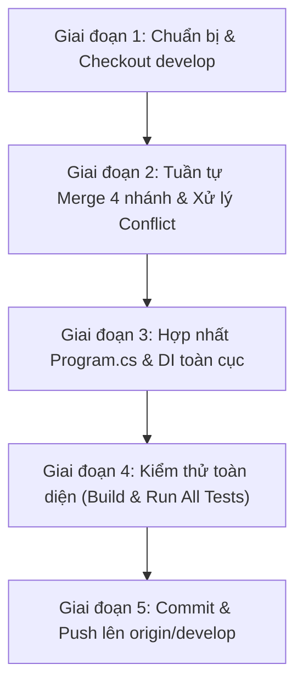

# KẾ HOẠCH TÍCH HỢP TOÀN DIỆN BACKEND VÀO NHÁNH DEVELOP
> **Dự án:** Culinary Blog — PTUDWNC-2026-Nhom11  
> **Mục tiêu:** Gộp (Merge) và tích hợp 100% mã nguồn Backend (41 REST API Endpoints) từ 4 nhánh thành viên vào nhánh `develop`.  
> **Người điều phối:** Tạ Nhật Nguyên (Nhóm trưởng)  
> **Tài liệu căn cứ:** [SRS.md](../requirements/SRS.md) Chương 3, 7, 8 & [docs/phan-cong-api-thanh-vien.md](../phan-cong-api-thanh-vien.md)

---

## 🎯 I. MỤC TIÊU & DANH SÁCH 4 NHÁNH CẦN GỘP

Tích hợp hoàn chỉnh 4 phân hệ độc lập từ 4 nhánh cá nhân về nhánh chính `develop`, đảm bảo mã nguồn thống nhất theo Clean Architecture, biên dịch **0 Error, 0 Warning**, vượt qua **100% Unit Tests** và sẵn sàng kết nối với Frontend:

1. 👤 **Nhánh TV1 (Liêng Hót Ha Luyến - 2312682):** `origin/2312682_LiengHotHaLuyen_Auth_backend`
   - *Phân hệ:* Xác thực, Phân quyền & Quản lý User (`FR-AUTH-001..007` — 10 APIs).
2. 👤 **Nhánh TV2 (Trần Quốc Quân - 2312726):** `origin/2312726_TranQuocQuan_Category_Search_backend`
   - *Phân hệ:* Danh mục, Tìm kiếm FTS & Giám sát (`FR-CAT-001..005`, `FR-SRCH-001..004`, `FR-OBS-001` — 10 APIs).
3. 👤 **Nhánh TV3 (Tạ Nhật Nguyên - 2312704):** `origin/2312704_TaNhatNguyen_Recipe-lifecycle_backend`
   - *Phân hệ:* Vòng đời Công thức, Xử lý Concurrency `xmin`, Thùng rác Admin & Readiness Probe (`FR-RCP-003..007`, `FR-OBS-001` — 11 APIs).
4. 👤 **Nhánh TV4 (Nguyễn Phú Quý - 2312731):** `origin/2312731_NguyenPhuQuy_Recipe-details_backend`
   - *Phân hệ:* Chi tiết Công thức (Nguyên liệu, Bước làm), Quản lý Media MinIO (`FR-RCP-008..010`, `FR-FILE-001/002` — 10 APIs).

---

## 📋 II. QUY TRÌNH THỰC HIỆN TỪNG BƯỚC (5 GIAI ĐOẠN CHUẨN)

---

### 🔹 GIAI ĐOẠN 1: CHUẨN BỊ & CHECKOUT `develop`
1. Lưu trữ và commit các tài liệu Kế hoạch (`docs/plans/`) và file kiểm thử (`RecipeLifecycle.http`) trên nhánh TV3.
2. Kiểm tra `git status` đảm bảo working tree hoàn toàn sạch sẽ.
3. Chuyển sang nhánh `develop` (`git checkout develop`).
4. Kéo bản cập nhật mới nhất từ remote (`git pull origin develop`).

---

### 🔹 GIAI ĐOẠN 2: TUẦN TỰ MERGE 4 NHÁNH VÀ XỬ LÝ CONFLICT

#### 1. Merge Nhánh TV1 (Xác thực & Identity):
- **Lệnh:** `git merge origin/2312682_LiengHotHaLuyen_Auth_backend -m "merge: tich hop module Auth va Identity (TV1) vao develop"`
- **Thành phần tích hợp:**
  - `IdentityService`, `JwtService`, `CurrentUser`, ASP.NET Core Identity DbContext.
  - Cấu hình JWT Bearer, Rate Limiter (10 req/min), Cookie policy, Refresh Token rotation.
  - Minimal API Endpoints tại `/api/v1/auth`.

#### 2. Merge Nhánh TV2 (Danh mục & Tìm kiếm FTS):
- **Lệnh:** `git merge origin/2312726_TranQuocQuan_Category_Search_backend -m "merge: tich hop module Category va Search FTS (TV2) vao develop"`
- **Thành phần tích hợp:**
  - CQRS Commands/Queries cho Category, Full-Text Search PostgreSQL (`tsvector` + GIN Index, trigger tự động).
  - Minimal API Endpoints tại `/api/v1/categories`, `/api/v1/recipes/search`, `/health`, `/health/live`.
  - Cấu hình Scalar OpenAPI document.

#### 3. Merge Nhánh TV3 (Vòng đời Công thức & Concurrency):
- **Lệnh:** `git merge origin/2312704_TaNhatNguyen_Recipe-lifecycle_backend -m "merge: tich hop module Recipe Lifecycle va Readiness Probe (TV3) vao develop"`
- **Thành phần tích hợp:**
  - CQRS Commands/Queries cho Recipe Lifecycle: Create, Update `xmin`, Publish, Unpublish, Archive, Unarchive, Soft Delete, Admin Trash/Restore/Purge.
  - Cổng Readiness Probe `/health/ready` kiểm tra kết nối PostgreSQL.
  - Toàn bộ tài liệu Kế hoạch chi tiết `docs/plans/` và bộ 33 Unit Tests.

#### 4. Merge Nhánh TV4 (Nội dung Chi tiết & MinIO Storage):
- **Lệnh:** `git merge origin/2312731_NguyenPhuQuy_Recipe-details_backend -m "merge: tich hop module Recipe Content va Media Storage (TV4) vao develop"`
- **Thành phần tích hợp:**
  - Quản lý Nguyên liệu (`RecipeIngredient`), Bước nấu (`RecipeStep` - tự động reorder).
  - Dịch vụ `IFileStorageService` upload ảnh MinIO, kiểm tra Magic bytes file.
  - Minimal API Endpoints cho Ingredients, Steps, Images.

---

### 🔹 GIAI ĐOẠN 3: HỢP NHẤT TOÀN DIỆN CẤU HÌNH HỆ THỐNG

1. **Chuẩn hóa `Program.cs`:**
   - Đăng ký middleware xử lý lỗi `GlobalExceptionHandler` theo chuẩn RFC 7807 Problem Details.
   - Đăng ký đầy đủ Dependency Injection: `AddApplication()`, `AddInfrastructure()`, `AddJwtAuthentication()`, `AddRateLimiter()`.
   - Đăng ký đầy đủ Route Groups:
     - `api.MapAuthEndpoints();`
     - `api.MapCategoryEndpoints();`
     - `api.MapRecipeLifecycleEndpoints();`
     - `api.MapRecipeSearchEndpoints();`
     - `api.MapRecipeDetailEndpoints();`
   - Đăng ký các cổng giám sát sức khỏe: `/health`, `/health/live`, `/health/ready`.
   - Đăng ký Scalar OpenAPI UI tại `/scalar/v1`.

2. **Chuẩn hóa `CulinaryBlogDbContext.cs`:**
   - Đảm bảo đầy đủ các `DbSet`: `Categories`, `Recipes`, `RecipeIngredients`, `RecipeSteps`, `RecipeImages`, `RecipeSlugHistories`, `RefreshTokens`.
   - Đảm bảo các cấu hình Entity và Global Query Filter (`IsDeleted == false`) hoạt động đồng bộ.

---

### 🔹 GIAI ĐOẠN 4: KIỂM THỬ ĐA TẦNG & NGHIỆM THU

1. **Biên dịch:** Chạy `dotnet build backend/CulinaryBlog.sln` ➔ Yêu cầu: `0 Error, 0 Warning`.
2. **Chạy Unit Tests toàn hệ thống:** 
   - Chạy `dotnet test backend/tests/CulinaryBlog.UnitTests/CulinaryBlog.UnitTests.csproj` ➔ Yêu cầu: Tất cả các bài test của 4 thành viên đều **Passed 100%**.
3. **Chạy thử Server Backend:**
   - Chạy `dotnet run --project backend/src/CulinaryBlog.API` và kiểm tra phản hồi từ các cổng:
     - `GET http://localhost:5000/health`
     - `GET http://localhost:5000/health/live`
     - `GET http://localhost:5000/health/ready`
     - `GET http://localhost:5000/api/v1/overview`

---

### 🔹 GIAI ĐOẠN 5: COMMIT & PUSH LÊN GITHUB
- Kiểm tra lại `git status` và `git log --oneline --graph`.
- Push nhánh `develop` đã tích hợp đầy đủ lên GitHub (`git push origin develop`).
- Cập nhật tài liệu tiến độ báo cáo nhóm.
