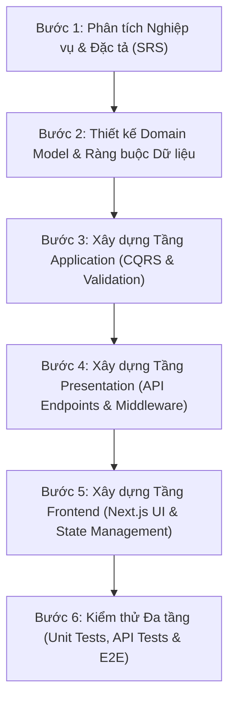

# QUY TRÌNH CHUẨN 6 BƯỚC PHÁT TRIỂN & HOÀN THIỆN MỘT CHỨC NĂNG
> **Dành cho Sinh viên thực hiện & Trả lời Vấn đáp Đồ án Môn học PTUDWNC**  
> **Áp dụng:** Clean Architecture + CQRS (.NET 10 Minimal API) & Full-Stack Next.js 15

---

## 🎯 TỔNG QUAN QUY TRÌNH PHÁT TRIỂN (6 BƯỚC CHUẨN KỸ NGHỆ PHẦN MỀM)

Khi Giảng viên hỏi: *"Khi nhận một yêu cầu chức năng, em thực hiện theo những bước nào để hoàn thiện từ A-Z?"*, đây là quy trình chuẩn cần trình bày:

---

### 1. Bước 1: Phân tích Nghiệp vụ & Đặc tả (Requirements Analysis)
- **Đọc & Đối chiếu SRS:** Xác định rõ Actor (Người dùng/Tác giả/Admin), Mã yêu cầu chức năng (FR Code), Điều kiện tiên quyết (Pre-conditions), Kết quả mong đợi (Post-conditions).
- **Xác định Ma trận chuyển trạng thái (State Machine) & Ràng buộc nghiệp vụ:** Xác định các trường hợp hợp lệ và các trường hợp lỗi nghiệp vụ (Business Exceptions).
- **Thiết kế Hợp đồng Dữ liệu (API Contract):** Xác định HTTP Method, URL Endpoint, Request Body/Query/Header, Response DTO và các mã HTTP Status Code chuẩn (200, 201, 400, 403, 404, 409, 422, 500).

---

### 2. Bước 2: Thiết kế Domain Model & Ràng buộc Dữ liệu (Domain Layer)
- **Entity & Value Objects:** Định nghĩa hoặc bổ sung thuộc tính cho Entity, quan hệ 1-N / N-N.
- **Quy tắc Nghiệp vụ Nội tại (Domain Methods):** Đóng gói logic chuyển trạng thái ngay trong Entity (VD: `recipe.Publish()`, `recipe.Archive()`, `recipe.SoftDelete()`) để bảo toàn tính toàn vẹn (Encapsulation / Rich Domain Model).
- **Xác định Domain Exceptions:** Tạo các lớp ngoại lệ kế thừa từ `DomainException` với mã lỗi định danh (`ErrorCode`) chuẩn theo Phụ lục B SRS (VD: `RecipeIncompletePublishException`, `OwnershipViolationException`).
- **Ràng buộc Concurrency:** Cấu hình trường kiểm soát xung đột dữ liệu (PostgreSQL `xmin` shadow property) cho Optimistic Concurrency Control.

---

### 3. Bước 3: Xây dựng Tầng Application (Application Layer - CQRS)
- **Tách biệt Đọc/Ghi (CQRS pattern):**
  - **Command (`IRequest<TResponse>`):** Xử lý thao tác ghi (Create, Update, Publish, Delete).
  - **Query (`IRequest<TResponse>`):** Xử lý thao tác đọc dữ liệu tối ưu.
- **Validation Pipeline:** Viết `AbstractValidator<TCommand>` bằng **FluentValidation** để kiểm tra tính hợp lệ dữ liệu đầu vào. Tích hợp qua MediatR `ValidationBehavior` để tự động ném `ValidationException` (HTTP 422).
- **Command/Query Handler:** 
  - Giao tiếp qua `IRepository<T>` và `IUnitOfWork` cho thao tác ghi.
  - Sử dụng trực tiếp `IApplicationDbContext` (với `AsNoTracking()` hoặc `IgnoreQueryFilters()`) cho thao tác đọc.
  - Tích hợp `ICurrentUserService` để kiểm tra phân quyền sở hữu (`AuthorId == CurrentUser.Id` hoặc `IsAdmin`).

---

### 4. Bước 4: Xây dựng Tầng Presentation (API Endpoints & Middlewares)
- **Đăng ký Minimal API Endpoints:** Định nghĩa Route Group, ánh xạ HTTP Method, khai báo OpenAPI Metadata (`WithSummary`, `ProducesProblem`).
- **Xử lý HTTP Headers & Caching:** Đọc và kiểm tra header `If-Match` cho Optimistic Concurrency, gắn `ETag` vào response header.
- **Xử lý Lỗi Toàn cục (Global Exception Handler):** Bắt các ngoại lệ Domain/Application và format response theo chuẩn **RFC 7807 Problem Details** (`application/problem+json`), không để lộ thông tin nhạy cảm.

---

### 5. Bước 5: Xây dựng Tầng Frontend (Frontend UI & State Management)
- **Chiến lược Rendering:** Xác định chiến lược phù hợp theo SRS Mục 5.1 (SSG, ISR, SSR, hoặc CSR cho Dashboard/Admin).
- **Xây dựng Form & Validation:** Sử dụng `react-hook-form` kết hợp schema `zod` để validate dữ liệu ngay tại Client.
- **Quản lý Server State:** Sử dụng **TanStack Query v5** (`useQuery`, `useMutation`), tối ưu cache và tự động invalidate queries sau mutation.
- **Xử lý Concurrency & Lỗi:** Bắt mã lỗi `409 Conflict`, mở Modal cảnh báo xung đột dữ liệu và hỗ trợ người dùng nạp lại dữ liệu mới nhất.

---

### 6. Bước 6: Kiểm thử Đa tầng & Đảm bảo Chất lượng (Testing & QA)
- **Unit Testing (xUnit + FluentAssertions + Moq):** Viết test kiểm tra 100% các nhánh nghiệp vụ của Handler, Domain State Transition, FluentValidation Rules.
- **API Testing:** Kiểm thử trực tiếp bằng file `.http` (REST Client) hoặc Swagger/Postman với đầy đủ các kịch bản thành công và thất bại.
- **Build & Lint Verification:** Đảm bảo `dotnet build` và `npm run build` hoàn thành với **0 Error, 0 Warning**.

---

## 📑 DANH MỤC CÁC BẢN KẾ HOẠCH CHI TIẾT THEO MODULE (BUỔI 4)

| Mã Kế hoạch | Tên Kế hoạch Module | Phân hệ / Màn hình | Liên kết chi tiết |
|:---:|---|---|---|
| **PLAN-01** | **Backend APIs: Vòng đời Công thức & Giám sát** | 11 Endpoints Backend (`FR-RCP-003..007`, `FR-OBS-001`) | [Xem PLAN_01](./buoi4/PLAN_01_Recipe_Lifecycle_Backend_APIs.md) |
| **PLAN-02** | **Frontend UI: Trang Tổng quan Dashboard** | `/dashboard` Overview (CSR) | [Xem PLAN_02](./buoi4/PLAN_02_Dashboard_Author_Admin_UI.md) |
| **PLAN-03** | **Frontend UI: Quản lý Bài viết & Vòng đời** | `/dashboard/recipes` My Recipes & Concurrency (CSR) | [Xem PLAN_03](./buoi4/PLAN_03_My_Recipes_Lifecycle_UI.md) |
| **PLAN-04** | **Frontend UI: Quản trị Thùng rác Admin** | `/admin/recipes/trash` Trash, Restore, Purge (CSR) | [Xem PLAN_04](./buoi4/PLAN_04_Admin_Trash_Management_UI.md) |
