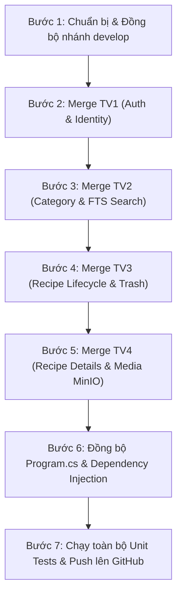

# KẾ HOẠCH TÍCH HỢP (PLAN 00): HỢP NHẤT TOÀN DIỆN 4 PHÂN HỆ BACKEND VÀO NHÁNH DEVELOP
> **Người chủ trì:** Tạ Nhật Nguyên (MSSV: 2312704 — Nhóm trưởng)  
> **Mục tiêu:** Gộp trọn vẹn mã nguồn 41 REST API Endpoints từ 4 nhánh cá nhân của 4 thành viên vào nhánh `develop`, xử lý triệt để xung đột mã nguồn (Conflict Resolution), đảm bảo toàn bộ Backend biên dịch sạch (`0 Error`, `0 Warning`) và pass 100% Unit Tests.  
> **Tài liệu căn cứ:** [SRS.md](../../requirements/SRS.md) Chương 8 (Đặc tả 41 API), [phan-cong-api-thanh-vien.md](../../phan-cong-api-thanh-vien.md)

---

## 🎯 DANH SÁCH 4 NHÁNH THÀNH VIÊN CẦN HỢP NHẤT

| STT | Thành viên phụ trách | Nhánh nguồn (Remote Branch) | Số API | Phân hệ Backend tích hợp |
|:---:|---|---|:---:|---|
| **1** | **Liêng Hót Ha Luyến** (2312682) | `origin/2312682_LiengHotHaLuyen_Auth_backend` | **10** | Xác thực & Quản lý User (`FR-AUTH-001..007`), Identity, JWT Rotation, Rate Limiting, Google OAuth, Email. |
| **2** | **Trần Quốc Quân** (2312726) | `origin/2312726_TranQuocQuan_Category_Search_backend` | **10** | Danh mục (`FR-CAT`), Tra cứu công thức, Full-Text Search PostgreSQL (`FR-SRCH`), Scalar OpenAPI, Health Check (`/health`, `/health/live`). |
| **3** | **Tạ Nhật Nguyên** (2312704 - Leader) | `origin/2312704_TaNhatNguyen_Recipe-lifecycle_backend` | **11** | Vòng đời Công thức (`FR-RCP-003..007`), Optimistic Concurrency `xmin`, Thùng rác Admin (Trash, Restore, Purge), Readiness Probe (`/health/ready`). |
| **4** | **Nguyễn Phú Quý** (2312731) | `origin/2312731_NguyenPhuQuy_Recipe-details_backend` | **10** | Nội dung chi tiết Công thức (`FR-RCP-008..010`), Nguyên liệu, Bước làm (Reorder), Hình ảnh & MinIO File Storage (`FR-FILE`). |
| **TỔNG CỘNG** | | | **41/41** | **Toàn bộ Backend hoàn chỉnh sẵn sàng phục vụ Frontend** |

---

## 📋 QUY TRÌNH 7 BƯỚC HỢP NHẤT CHI TIẾT (STEP-BY-STEP EXECUTION)



---

### Bước 1: Chuẩn bị & Đồng bộ nhánh `develop`
- Chuyển không gian làm việc sang nhánh `develop`: `git checkout develop`.
- Kéo mã nguồn mới nhất từ remote: `git pull origin develop`.
- Kiểm tra trạng thái working tree sạch sẽ trước khi tiến hành merge.

### Bước 2: Hợp nhất Phân hệ TV1 — Xác thực & Người dùng (Auth & Identity)
- Thực hiện merge: `git merge origin/2312682_LiengHotHaLuyen_Auth_backend`.
- **Các thành phần tiếp nhận:**
  - Tầng Domain: `ApplicationUser`, `RefreshToken`, Domain Exceptions cho Auth.
  - Tầng Application: `IIdentityService`, `IJwtService`, `ICurrentUserService`, Auth Commands & Queries.
  - Tầng Infrastructure: Cấu hình ASP.NET Core Identity, JWT Bearer Options, Token Provider.
  - Tầng API: `AuthEndpoints.cs`, Rate Limiting Middleware.
- Kiểm tra biên dịch sơ bộ: `dotnet build backend/CulinaryBlog.sln`.

### Bước 3: Hợp nhất Phân hệ TV2 — Danh mục & Tìm kiếm (Category & Search)
- Thực hiện merge: `git merge origin/2312726_TranQuocQuan_Category_Search_backend`.
- **Các thành phần tiếp nhận:**
  - Tầng Application: `CategoryCommands`, `CategoryQueries`, `SearchRecipesQuery` (Full-Text Search với `NpgsqlTsVector`).
  - Tầng Infrastructure: Cấu hình GIN Index, trigger tự động cập nhật SearchVector trong PostgreSQL.
  - Tầng API: `CategoryEndpoints.cs`, `DiscoveryEndpoints.cs`, Scalar OpenAPI / Swagger configuration.
- Kiểm tra và giải quyết xung đột (nếu có) trong `CulinaryBlogDbContext.cs` và `DependencyInjection.cs`.

### Bước 4: Hợp nhất Phân hệ TV3 — Vòng đời Công thức & Giám sát (Recipe Lifecycle)
- Thực hiện merge: `git merge origin/2312704_TaNhatNguyen_Recipe-lifecycle_backend`.
- **Các thành phần tiếp nhận:**
  - Tầng Application: `CreateRecipe`, `UpdateRecipe` (Optimistic Concurrency), `PublishRecipe`, `UnpublishRecipe`, `ArchiveRecipe`, `UnarchiveRecipe`, `DeleteRecipe`, `GetTrashedRecipes`, `RestoreRecipe`, `PurgeRecipe`.
  - Tầng API: `RecipeLifecycleEndpoints.cs`, Cổng giám sát `GET /health/ready`.
  - Tầng Unit Tests: Bộ 33 unit test kiểm thử State Transition, Validation, Admin Trash, Slug Generator.
  - Tài liệu: Thư mục `docs/plans/` (Quy trình 6 bước và các bản Plan Buổi 4).
- Kiểm tra biên dịch và chạy test: `dotnet test`.

### Bước 5: Hợp nhất Phân hệ TV4 — Chi tiết Công thức & Đa phương tiện (Details & Media)
- Thực hiện merge: `git merge origin/2312731_NguyenPhuQuy_Recipe-details_backend`.
- **Các thành phần tiếp nhận:**
  - Tầng Domain: `RecipeIngredient`, `RecipeStep`, `RecipeImage`.
  - Tầng Application: Commands thêm/sửa/xóa nguyên liệu, bước làm (kèm `ReorderRecipeStepsCommand`), upload ảnh.
  - Tầng Infrastructure: `IFileStorageService`, MinIO Client Service, kiểm tra Magic Bytes file ảnh.
  - Tầng API: `RecipeContentEndpoints.cs`, `RecipeImageEndpoints.cs`.
  - Tầng Unit Tests: Bộ unit test cho Content & MinIO File Storage.

### Bước 6: Tinh chỉnh & Đồng bộ Tệp Cấu hình Khởi động (`Program.cs`)
- Mở và rà soát file `backend/src/CulinaryBlog.API/Program.cs`:
  - Đăng ký đầy đủ các dịch vụ từ 4 tầng: `builder.Services.AddApplication()`, `builder.Services.AddInfrastructure()`, `builder.Services.AddProblemDetails()`, `builder.Services.AddExceptionHandler<GlobalExceptionHandler>()`.
  - Cấu hình Authentication & Authorization: `app.UseAuthentication()`, `app.UseAuthorization()`.
  - Cấu hình Rate Limiter cho các API nhạy cảm.
  - Đăng ký Scalar OpenAPI UI để trực quan hóa toàn bộ 41 API trên giao diện Swagger/Scalar.
  - Đăng ký toàn bộ Route Groups:
    ```csharp
    var api = app.MapGroup("/api/v1");
    api.MapAuthEndpoints();
    api.MapCategoryEndpoints();
    api.MapRecipeLifecycleEndpoints();
    api.MapRecipeContentEndpoints();
    api.MapSearchEndpoints();
    ```
  - Đăng ký bộ 3 cổng Health Checks:
    - `GET /health` (Tổng quan các phụ thuộc)
    - `GET /health/live` (Liveness Probe cho Docker/K8s)
    - `GET /health/ready` (Readiness Probe kiểm tra kết nối DB)

### Bước 7: Kiểm thử Tổng hợp, Đóng gói & Push lên GitHub
- Chạy lệnh build toàn bộ dự án:
  ```bash
  dotnet build backend/CulinaryBlog.sln
  ```
  *(Yêu cầu: 0 Error, 0 Warning).*
- Chạy toàn bộ bộ kiểm thử tự động của tất cả các module:
  ```bash
  dotnet test backend/CulinaryBlog.sln
  ```
  *(Yêu cầu: 100% Tests Passed).*
- Tạo commit merge hoàn chỉnh:
  ```bash
  git commit -m "merge: tich hop toan dien 4 phan he Backend (41 REST APIs) vao nhanh develop"
  ```
- Đẩy mã nguồn lên remote `develop`:
  ```bash
  git push origin develop
  ```

---

## 🎤 BỘ CÂU HỎI VẤN ĐÁP THƯỜNG GẶP (Q&A CHEATSHEET)

**Q1: Khi nhiều thành viên cùng phát triển Backend trên Clean Architecture, làm thế nào để tránh xung đột mã nguồn khi gộp code?**
> *Trả lời:* "Nhóm em áp dụng nguyên tắc phân tách trách nhiệm theo **Feature-driven Folder Structure** kết hợp **CQRS**: Mỗi thành viên làm việc trên các thư mục Feature riêng biệt trong `Application/Features/` và các Endpoints riêng biệt trong `API/Endpoints/`. Điểm giao thoa duy nhất là các file cấu hình khởi động (`Program.cs`, `CulinaryBlogDbContext.cs`), do đó khi merge chỉ cần thống nhất đăng ký DI và Route Groups là hệ thống tích hợp mượt mà không bị ghi đè code của nhau."

**Q2: Sau khi gộp code vào `develop`, em kiểm tra tính đúng đắn của toàn bộ hệ thống bằng cách nào?**
> *Trả lời:* "Em thực hiện kiểm thử 3 lớp: Lớp 1 là biên dịch nghiêm ngặt toàn bộ Solution `dotnet build`; Lớp 2 là chạy toàn bộ bộ Unit Tests tự động `dotnet test` bao phủ các quy tắc nghiệp vụ của cả 4 phân hệ; Lớp 3 là khởi chạy Backend và mở giao diện **Scalar OpenAPI / Swagger UI** để trực tiếp gọi thử các API liên phân hệ (như Tạo User ➔ Đăng nhập lấy JWT ➔ Tạo Danh mục ➔ Tạo Công thức ➔ Thêm Nguyên liệu ➔ Xuất bản)."
