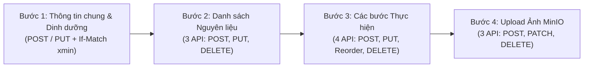

# KẾ HOẠCH TRIỂN KHAI FRONTEND UI: MULTI-STEP WIZARD TẠO & CHỈNH SỬA CÔNG THỨC
> **Mã Kế hoạch:** `PLAN-06`  
> **Thành viên phụ trách:** Thành viên 4 — Nguyễn Phú Quý (MSSV: `2312731`)  
> **Màn hình phụ trách (Mục 5.1 SRS):**  
> 1. `/dashboard/recipes/new` — Form Tạo Công Thức Multi-step Wizard 4 bước (CSR)  
> 2. `/dashboard/recipes/[id]/edit` — Form Chỉnh sửa Toàn diện Công thức kèm Concurrency Control (CSR)

---

## 1. KIẾN TRÚC GIAO DIỆN MULTI-STEP WIZARD 4 BƯỚC (`RecipeWizardEditor.tsx`)

### Bước 1: Thông tin chung & Dinh dưỡng (`RecipeNutrition`)
- Nhập Tiêu đề (3–250 ký tự), Mô tả, Danh mục (`CategoryId`), Độ khó (`Easy` / `Medium` / `Hard`), Thời gian sơ chế (`PrepTimeMinutes`), Thời gian nấu (`CookTimeMinutes`), Khẩu phần gốc (`Servings`).
- Tùy chọn bật/tắt bảng thông số Dinh dưỡng trên 1 khẩu phần (`Calories`, `ProteinGrams`, `FatGrams`, `CarbsGrams`, `FiberGrams`, `SodiumMg`).
- Hỗ trợ Optimistic Concurrency Control: Gửi kèm header `If-Match: "{xmin}"` khi cập nhật và hiển thị `ConflictDialog` nếu nhận mã lỗi `409 Conflict`.

### Bước 2: Danh sách Nguyên liệu động (3 API của TV4)
- Tích hợp `POST /api/v1/recipes/{id}/ingredients`, `PUT /api/v1/recipes/{id}/ingredients/{ingredientId}`, `DELETE /api/v1/recipes/{id}/ingredients/{ingredientId}`.
- Hỗ trợ nhập định lượng số thực (`decimal`, ví dụ `1.5`, `0.25`) và gợi ý đơn vị tính (`g`, `kg`, `ml`, `muỗng canh`...).
- Tích hợp tùy chọn **"Gia vị nêm nếm vừa đủ"** (`Quantity = null`, `Unit = null`) theo Quyết định Thiết kế **E1 & E2**.

### Bước 3: Các bước Thực hiện & Sắp xếp Reorder (4 API của TV4)
- Tích hợp `POST /api/v1/recipes/{id}/steps`, `PUT /api/v1/recipes/{id}/steps/{stepId}`, `PUT /api/v1/recipes/{id}/steps/reorder`, `DELETE /api/v1/recipes/{id}/steps/{stepId}`.
- Cho phép nhập thời gian hẹn giờ (`DurationMinutes`) cho từng bước để phục vụ tính năng Đồng hồ đếm ngược ở Chế độ Nấu ăn.
- Nút di chuyển Lên/Xuống gọi API `PUT /steps/reorder` để cập nhật thứ tự `1..N` nguyên tử; xóa bước tự động đánh lại số thứ tự liên tục.

### Bước 4: Upload Ảnh MinIO & Quản lý Album (3 API của TV4)
- Tích hợp `POST /api/v1/recipes/{id}/images` (`multipart/form-data`), `PATCH /api/v1/recipes/{id}/images/{imageId}`, `DELETE /api/v1/recipes/{id}/images/{imageId}`.
- Kiểm tra chặt chẽ ở Client trước khi upload:
  - Chỉ chấp nhận định dạng: `image/jpeg`, `image/png`, `image/webp`, `image/avif`.
  - Dung lượng tối đa: $\le 5\text{MB}$ (`5 * 1024 * 1024` bytes).
- Tối ưu hiển thị khung ảnh tỷ lệ cố định `aspect-ratio: 16 / 10` chống giật bố cục (Cumulative Layout Shift - CLS), cho phép chọn Ảnh đại diện chính (`IsPrimary`) và cập nhật `AltText` chuẩn SEO/Accessibility.
